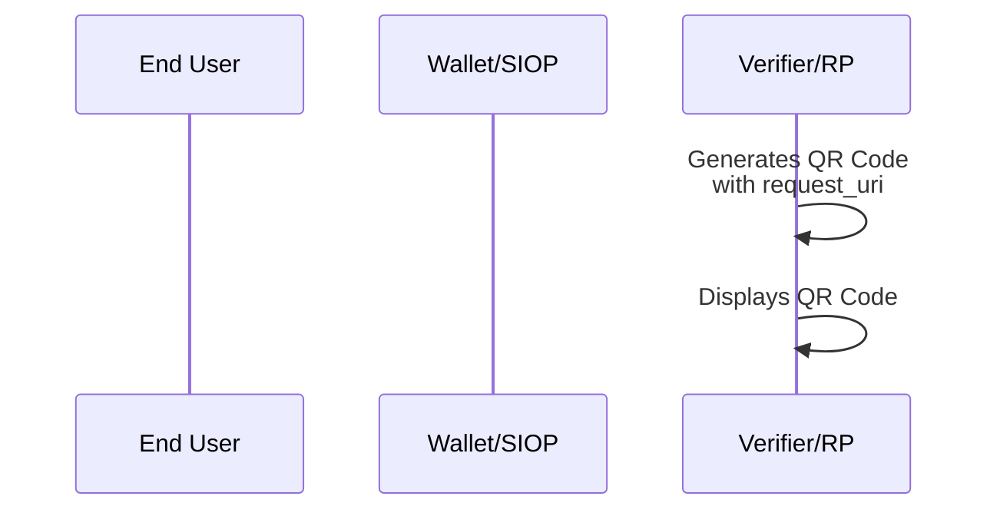
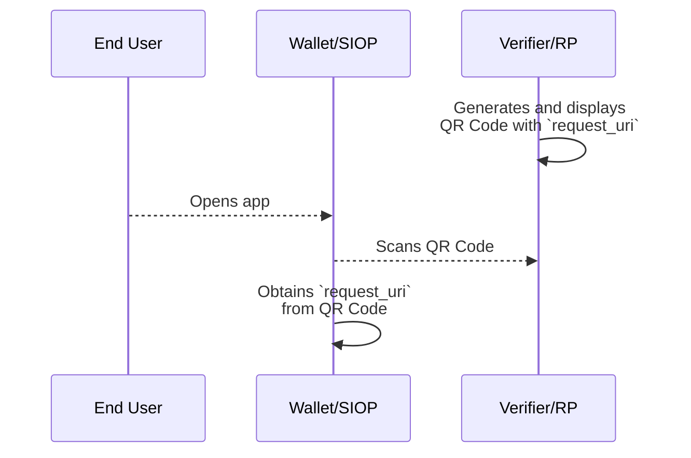
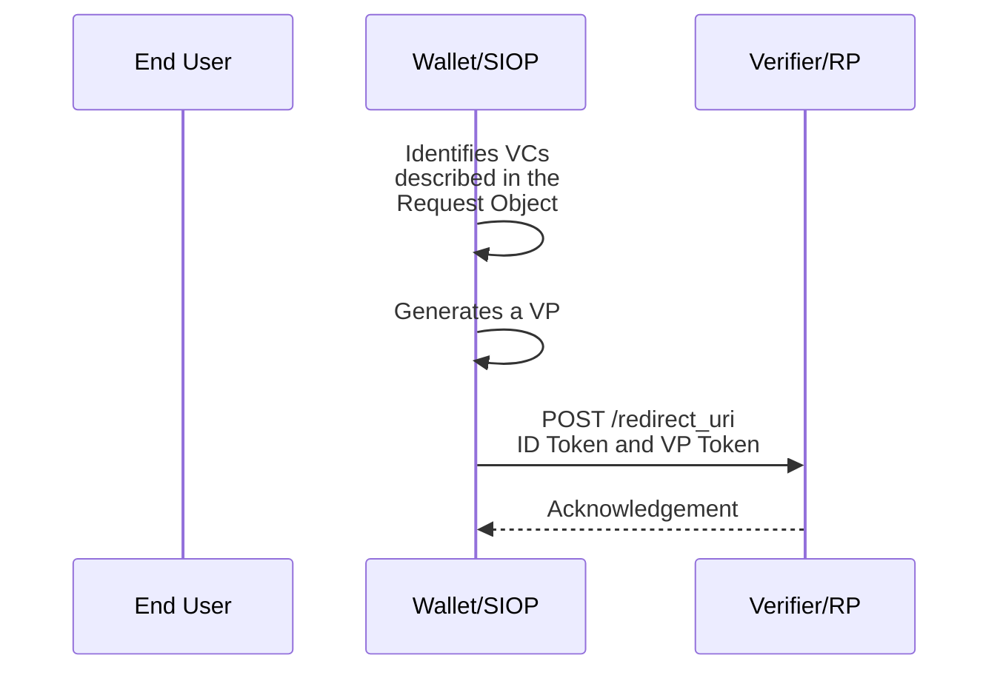

JWT VC Presentation Profile
==================

**Profile Status:** Draft

**Latest Draft:**
[https://identity.foundation/jwt-vc-presentation-profile](https://identity.foundation/jwt-vc-presentation-profile)

Editors:
~ [Daniel McGrogan](www.linkedin.com/in/dtmcgrogan) (Workday)
~ [Kristina Yasuda](https://www.linkedin.com/in/kristina-yasuda-6263b5a2) (Microsoft)
~ [Jen Schreiber](https://www.linkedin.com/in/jischr/) (Workday)

Contributors:
~ Tobias Looker (Mattr)
~ Andrew Hughes (Ping Identity)
~ David Waite (Ping Identity)
~ Valerie Lanard (Workday)
~ Daniel Godbout (Microsoft)
~ Rohit Gulati (Microsoft)
~ Eric Kuhn (Kraken)

Participate:
~ [GitHub repo](https://github.com/decentralized-identity/jwt-vc-presentation-profile)
~ [File a bug](https://github.com/decentralized-identity/jwt-vc-presentation-profile/issues)
~ [Commit history](https://github.com/decentralized-identity/jwt-vc-presentation-profile/commits/main)

------------------------------------

## Abstract

The JWT VC Presentation Profile defines a set of specifications to enable the interoperable presentation of Verifiable Credentials between Wallets and Verifiers/RPs.

### Audience

Who is the audience for this document.

## Status of This Document

The status of the JWT VC Presentation Profile v1.0.0 is a PRE-DRAFT specification under development within the Decentralized Identity Foundation (DIF).

### Description

The [[ref: VC Data Model v1.1]] defines the data model of Verifiable Credentials (VCs) but does not prescribe standards for transport protocol, key management, authentication, query language, etc. As a result, implementers must decide which standards to use for their presentations without a guarantee that others will support the same set of standards.

This document aims to provide a path to interoperability by standardizing the set of specifications that enable the presentation of JWT-VCs between implementers. Future versions of this document will include details on issuance and wallet interoperability. Ultimately, this profile will define a standardized approach to Verifiable Credentials so that distributed developers, apps, and systems can share credentials through common means.


### Scope

#### Scope
This document is currently scoped for the presentation of VCs between the Self-Issued OP and the Verifier/RP, also known as the RP. The Self-Issued OP is a native mobile application. The following aspects of the presentation are covered:

- Data model
- Key management
- Transportation of VCs
- Query language
- Identifiers of the entities
- Revocation of VCs

The JWT VC Presentation Profile currently supports only one response mode, assuming that a Self-Issued OP is on a different device than the one on which the End-User has initiated a user interaction at the Verifier/RP, even if it is not.

Supporting an additional response mode when Self-Issued OP is on the same device as the one on which the End-User has initiated a user interaction at the Verifier/RP might be added in the future.

#### Out of Scope
The following items are out of scope for the current version of this document:
- Issuance of VCs
- Advanced concepts in the [[ref: VC Data Model v1.1]]:
    - `credentialSchema` (`credentialType` is used instead)
    - `refreshService`
    - `termsOfUse`
    - `evidence`
    - Selective disclosure and unlinkability
    - Zero-Knowledge Proofs
    - Disputes
- Non-native Self-Issued OPs like web applications, PWAs, etc.

Note: Although selective disclosure and unlinkability are out of scope of this document, future versions will include JSON Web Proofs ([[ref:JWP]]) and JSON Web Algorithms ([[ref:JWA]]) once they get ratified in IETF.

## Structure of this Document

A description to the reader on how the document is structured.

## Terminology

This section consolidates in one place common terms used across open standards that this profile consists of. For the details of these, as well as other useful terms, see text within each of the specification listed in [[ref:References]].

[[def:Authorization Request]]
~ OAuth 2.0 Authorization Request extended by [[ref:OIDC]] and [[ref:OpenID4VP]]

[[def:Authorization Response]]
~ OAuth 2.0 Authorization Response extended by [[ref:OIDC]] and [[ref:OpenID4VP]]

[[def:Claim, Claims]]
~ An assertion made about the subject of a credential

[[def:Decentralized Identifier, DID]]
~ An identifier with its core ability being enabling Clients to obtain key material and other metadata by reference

[[def:End User]]
~ Participant

[[def:Holder]]
~ An entity that possesses or holds verifiable credentials and can generate verifiable presentations from them as defined in [[ref: VC Data Model]].

[[def: OpenID Provider (OP), OpenID Provider, OP]]
~ OAuth 2.0 Authentication Server implementing [[ref:OIDC]] and [[ref:OpenID4VP]]

[[def: Presentation]] 
~ Data derived from one or more verifiable credentials, issued by one or more issuers, that is shared with a verifier

[[def: Relying Party (RP), Relying Party, RP]]
~ OAuth 2.0 Client application using [[ref:OIDC]] and [[ref:OpenID4VP]] in [[ref:SIOPv2]]. Synonymous with term
  [[ref:Verifier]] in [[ref: VC Data Model]]

[[def:Request Object]]
~ JWT that contains a set of request parameters as its [[ref:Claims]]
  
[[def:Self Issued OpenID Provider (SIOP), Self Issued OpenID Provider, SIOP]]  
~ An OpenID Provider (OP) used by an [[ref:End User]] to prove control over a cryptographically verifiable identifier such as a [[ref:DID]].

[[def:Verifiable Credential (VC), Verifiable Credential, VC]]
~ A set of one or more [[ref:Claims]] made by an issuer that is tamper-evident and has authorship that can be cryptographically
  verified.

[[def:Verifiable Presentation (VP), Verifiable Presentation, VP]] 
~ A [[ref:Presentation]] that is tamper-evident and has authorship that can be cryptographically verified

[[def:Verifier]]
~ An entity that receives one or more verifiable credential inside a verifiable presentation for processing. Synonymous
  with the term [[ref: Relying Party (RP)]]

[[def:Verification]]
~ The process in which a [[ref:Verifier]] validates that the verifiable credential inside a verifiable presentation is authentic
  and a timely statement of the issuer or presenter

[[def:Wallet]]
~ An entity that receives, stores, presents, and manages credentials and key material of the End User. Acts as a [[ref:Self Issued OpenID Provider (SIOP)]]

## Profile

### The Protocol Flow

This section briefly describes the end to end verification flow. Concepts and terms mentioned here will be described in more detail in subsequent sections of this document.

The flow begins as the Verifier generates a QR Code that contains a `request_uri` parameter which allows Self-Issued OP (SIOP) Request to be passed by reference. Verifier displays this QR code on their Verifier Website to initiate the exchange.




Verifier Website presents the QR Code to the End User on their Verifier Website. The End User scans the QR Code using their Wallet. The Wallet parses the QR code to obtain the `request_uri`.

The Wallet sends a GET request to the obtained `request_uri` to retrieve the Request Object. The Request Object is a signed JWT that contains a set of request parameters as defined in [[ref: SIOPv2 ID1]] and [[ref: OpenID4VP ID1]]. In particular, Wallet will determine which VCs to submit to the Verifier by processing `presentation_definition` property in the Request Object.



Upon receiving the Request Object, the Wallet will identify VCs that satisfy the Presentation Definition and encapsulate them in a Verifiable Presentation (VP). The Wallet will complete the SIOP or Authorization Response by sending an ID Token and a VP Token to the Verifier's `redirect_uri`.

Upon receiving the ID Token and VP Token, Verifier performs necessary checks such as DID resolution, signature validation, Linked Domain validation, revocation checks, etc. and sends an acknowledgement of receipt back to the Wallet. The flow of the Wallet presenting VCs to the Verifier is now complete.



### Overview of the Open Standards Requirements

- VCs MUST adhere to the [[ref: VC Data Model v1.1]] and be encoded as JSON and signed as JWT as defined in 6.3.1 of [[ref: VC Data Model v1.1]]. VCs encoded as JSON-LD and signed using Linked Data Proofs are NOT supported.
- For key management and authentication, First Implementer's Draft of Self-Issued OpenID Connect Provider v2, an extension to OpenID Connect, MUST be used as defined in [[ref: SIOPv2 ID1]].
- For transportation of VCs, First Implementer's Draft of OpenID for Verifiable Presentations MUST be used as defined in [[ref: OpenID4VP ID1]].
- As the query language, [[ref: Presentation Exchange v1.0.0]] MUST be used and conform to the syntax defined in [[ref: OpenID4VP ID1]].
- Decentralized Identifiers (DIDs), as defined in [[ref: DID Core]], MUST be used as identifiers of the entities. Implementations MUST support did:web and did:ion as a mandatory DID method as defined in [[ref: did-web]] and [[ref: did-ion]].
- To bind an owner of a DID to a controller of a certain origin, a Well Known DID Configuration MUST be used as defined in [[ref: Well Known DID]].
- For Revocation of VCs, Status List 2021 as defined in [[ref: Status List 2021]] MUST be discovered using either DID Relative URLs stored in an HTTPS URL or ID Hub be used in combination with Identity Hubs as defined in [[def: Identity Hub (0.0.1 Predraft)]] (Decentralized Web Node v0.0.1 predraft).

It is important to note that Cross-device SIOP is susceptible to a session phishing attack, where an attacker relays the request from a good Verifier/RP to a victim and is able to sign in as a victim. Implementers MUST implement mitigations most suitable to the use-case. For more details and concrete mitigations, see section 15 Security Considerations in [[ref: SIOPv2 ID1]].

This profile uses certain versions of specifications that have not yet reached final status: For more details see Normative References section.

  - First Implementer's Draft of Self-Issued OpenID Provider v2 specification
  - First Implementer's Draft of OpenID for Verifiable Prensetations specification
  - ID Hub specification published as a v0.0.1 predraft of [Decentralized Web Node](https://identity.foundation/decentralized-web-node/spec/). We will continue to use the term ID Hub rather than Decentralized Web Node to avoid confusion.

### JWT VCs

#### Using JWT claims instead of their counterparts in the data model specification

Section 6.3.1 of [[ref: VC Data Model v1.1]] provides two options for how to encode properties defined in VC Data Model v1.1 as a JWT:
  1. Use registered JWT claims instead of respective counterparts defined in a VC Data Model v1.1.
  2. Use JWT claims in addition to VC Data Model v1.1 counterparts

For the purpose of this profile, registered JWT claims `exp`, `iss`, `nbf`, `jti`, `sub` and `aud` MUST be used in a JWT-VC instead of their respective counterparts defined in VC Data Model v1.1.

#### Base64url Encoding of a JWT encoded VC included in a VP

Verifiable Credentials included in a JWT-encoded Verifiable Presentation MUST be Base64url encoded. 

Base64url encoding is defined as a base64 encoding using the URL and filename safe character set defined in Section 5 of RFC4648, with all trailing '=' characters omitted (as permitted by Section 3.2 of RFC4648) and without the inclusion of any line breaks, whitespace, or other additional characters. Note that the base64url encoding of the empty octet sequence is the empty string. (See Appendix C of RFC7515 for notes on implementing base64url encoding without padding.)

#### `exp` JWT claim

`exp` JWT claim in JWT encoded VC or VP MUST be used to set the value of the "expirationDate" of the VC or VP, and not of the credentialSubject.

#### `nbf` JWT claim

[[ref: VC Data Model v1.1]] specifies that "issuanceDate" property MUST be represented as an `nbf` JWT claim, and not `iat` JWT claim. This might sound couterintuitive, but the implementers of this profile MUST follow this guidance.

### Authorization Request

[[ref: SIOPv2 ID1]] MUST be used for key management and authentication, [[ref: OpenID4VP ID1]] MUST be used to transport Verifiable Credentials, and [[ref: Presentation Exchange]] MUST be used as a query language as defined in [[ref: OpenID4VP ID1]].

#### Invoking Self-Issued OP

Custom URL Scheme `openid-vc://` MUST be used to invoke Self-Issued OP.

#### Self-Issued OP Request URI

Request object shall be passed by reference, rather than by value, as defined in Section 6.2 of [[ref: OIDC]]. The Holder Wallet retrieves full Request Object value from the resource at the `request_uri`.

There are multiple ways for a Verifier/RP to communicate `request_uri` to the Self-Issued OP. `request_uri` can be obtained from a QR code when Self-Issued OP is on a different device than the one on which the user interaction is occurring. It can also be obtained from a deep link when Self-Issued OP is on the same device as the one on which the user interaction is occurring.

The Self-Issued OP Request URI has an `openid` scheme.

The `request_uri` parameter is a HTTP URL from where the Holder Wallet can retrieve a full Request Object.

The Holder Wallet will retrieve the Request Object value from the `request_uri` as defined in section 6 of [[ref: OIDC]].

The Self-Issued OP request URI MUST include the following parameter:
* `request_uri`
  * REQUIRED. URL where Request Object value can be retrieved from, as specified in section 6.2 of [[ref: OIDC]].

Below is a non-normative example of a Self-Issued OP URI which will be encoded into a QR code:

```uri
openid-vc://?request_uri=https://someverifierdomain.com/v1.0/verifiablecredentials/request/a0eed079-672f-4055-a4f5-e0f5d76ecdea
```
::: todo
Need to add QR Code above
:::

#### Self-Issued OP Request Object

Upon receipt of the Request, the Holder Wallet MUST send an HTTP GET request to the `request_uri` to retrieve the referenced Request Object, unless it is already cached, and parse it to recreate the Request parameters.

The response body to that request must be an encoded JWT. The media type must be `application/jwt`

Below is a non-normative unencoded example of a retrieved Request Object:

::: example Non-Normative Request Object
```json
[[insert: ./spec/assets/3_siopv2_request.json]]
```
:::

##### Self-Issued OP Request Parameters

The Self-Issued OP request object obtained via request_uri MUST include the following parameters and values:

* `scope`
  * REQUIRED. MUST be `openid`.
* `response_type`
  * REQUIRED. MUST be `id_token`.
* `response_mode`
  * REQUIRED. MUST be `post`. Self-Issued OP Response will be sent as an HTTP POST request.
* `client_id`
  * REQUIRED. MUST be a DID of a Verifier/RP. MUST use DID method ION.
* `redirect_uri`
  * REQUIRED. URI where the response will be sent.
* `nonce`
  * REQUIRED. String value used to associate a Client session with an ID Token, and to mitigate replay attacks, as specified in section 3.1.2.1. of [[ref: OIDC]].


##### Self-Issued OP Discovery

The Verifier/RP MUST use static Self-Issued OP metadata as defined in section 6.2.1 of [[ref: SIOPv2 ID1]].

::: example SIOP Metatdata
```json
[[insert: ./spec/assets/1_siop_metadata.json]]
```
:::

##### Verifier/RP Registration Metadata

The Self-Issued OP request MUST be signed. Decentralized Identifier resolution as defined in section 10.2.2.2. of [[ref: SIOPv2 ID1]] MUST be used as the Verifier/RP Registration Metadata Resolution Method.

The RP MUST support Subject Syntax Type `did:ion` as specified in section 9.2.3. in [[ref: SIOPv2 ID1]]. RP's `client_id` MUST be expressed as using a `did:ion` URI, and the public key used to sign the request MUST be obtained from the `verificationMethod` property of a DID Document. The public key used to sign the request in question MUST be identified by the `kid` in the header of the signed request.

All RP metadata other than the public key MUST be obtained from the `registration` parameter as defined in section 6.3.1. of [[ref: SIOPv2 ID1]].

The following are Verifier/RP Registration Metadata parameters and values:
* `subject_syntax_types_supported`
  * REQUIRED. MUST include `did:ion`. Defined in [[ref: SIOPv2 ID1]].
* `vp_formats`
  * REQUIRED. MUST include `jwt_vp` and `jwt_vc`, and support signature algorithms `ES256K` and `EdDSA`. Defined in [[ref: OpenID4VP ID1]].
* `client_name`
  * OPTIONAL. Name of the Verifier/RP to be displayed to the End-User. If present, the server SHOULD display this name to the End-User during approval. Defined in [[ref: OIDC Registration]]. If desired, representation of this Claim in different languages and scripts is represented as described in Section 2.1 of [[ref: OIDC Registration]].
* `logo_uri`
  * OPTIONAL. URL that references a logo for the Verifier/RP application. If present, the server SHOULD display this image to the End-User during approval. The value of this field MUST point to a valid image file. Defined in [[ref: OIDC Registration]]. If desired, representation of this Claim in different languages and scripts is represented as described in Section 2.1 of [[ref: OIDC Registration]].
* `client_purpose`
  * OPTIONAL. The reason why the Verifier/RP is requesting the user to present a certain credential. If present, the server SHOULD display this purpose to the End-User during approval. Defined in this document.

Below is a normative example of claims included in the `registration` parameter:

::: example
```json
{
  "subject_syntax_types_supported": [
    "did:ion"
  ],
  "vp_formats": {
    "jwt_vp": {
      "alg": [
        "ES256K",
        "EdDSA"
      ]
    },
    "jwt_vc": {
      "alg": [
        "ES256K",
        "EdDSA"
      ]
    }
  },
  "client_name": "Interop WG",
  "client_purpose": "Please share this information with us to get access to our library."
}
```
:::

Other Registration parameters defined in [[ref: OIDC Registration]] can be used.

##### Linked Domain Verification

To strengthen trust between the Verifier/RP and End-user, a Verifier/RP's DID must be bound to its website. This proves the Verifier/RP controls both the DID and the origin and allows the End-user to verify this relationship. To bind an owner of a DID to a controller of a certain origin, Well Known DID Configuration MUST be used as defined in [[ref: Well Known DID]].

When creating a Verifier/RP's DID, the domain linked to that DID MUST be included in a `serviceEndpoint` property of the DID Document as shown in a non-normative response below:

::: example
```json
{
  "service": [
    {
      "id": "#domain-1",
      "type": "LinkedDomains",
      "serviceEndpoint": "https://vcsatoshi.com"
    }
  ]
}
```
:::
Prior to a presentation request, the Verifier/RP MUST create a Domain Linkage Credential in a JSON Web Token format. It MUST be included on the website via '/.well-known/did-configuration.json'.

Below is a non-normative example of a Domain Linkage Credential that is hosted at `https://www.vcsatoshi.com/.well-known/did-configuration.json`:

::: example Domain Linkage Credential
```json
[[insert: ./spec/assets/2_domain_linkage_credential.json]]
```
:::

##### Requesting Verifiable Credentials

A Specific VC type MUST be requested using [[ref: Presentation Exchange]] syntax in the Self-Issued OP request as defined in section 8 of [[ref: OpenID4VP ID1]]. `presentation_definition` property defined in [[ref: Presentation Exchange]] MUST be included in a `vp_token` property as defined in [[ref: OpenID4VP ID1]], which MUST be included in a `claims` parameter defined in [[ref: OIDC]].

Below is a non-normative example of a `claims` parameter:
```json
{
  "claims": {
    "vp_token": {
      "presentation_definition": {
        "id": "c278823a-f9d7-4a22-9a73-4a1bcd87f60e",
        "input_descriptors": [
          {
            "id": "InteropExampleVC",
            "name": "InteropExampleVC",
            "purpose": "We need to verify that you have a valid InteropExampleVC Verifiable Credential.",
            "schema": [
              {
                "uri": "InteropExampleVC"
              }
            ]
          }
        ]
      }
    }
  }
}
```

### End-user Consent

When the Self-Issued OP displays the consent screen to the user, it is RECOMMENDED to display the domain name obtained using [Linked Domains](#linked-domain-verification). Displaying details of the consent using registration parameters such as `client_name`, `logo_uri`, and `client_purpose` defined in [Registration Metadata](#verifierrp-registration-metadata) is OPTIONAL.

Note that displaying the domain name of the Verifier/RP helps the End-users to identify malicious Verifiers/RPs who has copied registration parameters of good Verifiers/OP and are impersonating them.

### Authorization Response

Authorization Response is sent as an HTTPS POST request to the RP's endpoint indicated in `redirect_uri` in the request.

Note that when this response_mode is used, the user will finish the transaction on the device with a Self-Issued OP, which is a different device than on which the user initiated a request. It is up to the implementations to enable further user interaction with the Verifier/RP on the device used to initiate the request.

### Structure of Authentication Response

Since requested VCs are returned in a VP Token, two artifacts MUST be returned:

1. ID Token that serves as an authentication receipt and includes metadata about the VP Token
1. VP Token that includes one or more Verifiable Presentations

`presentation_submission` object located inside an ID Token specifies metadata such as format and path of both VPs and VCs in the VP Token.

This profile currently supports including only a single VP in the VP Token. In such cases, as defined in section 5.2 of [[ref: OpenID4VP ID1]], when the Self-Issued OP returns a single VP in the `vp_token`, VP Token is not an array, and a single VP is passed as a `vp_token`. In this case, the descriptor map would contain a simple path expression "$".

Note that when in the future use-cases multiple VPs are included in the VP Token, VP Token itself is not signed, and each VP included inside the VP Token MUST be signed.

This profile currently assumes that ID Token and a single VP passed as a VP Token are signed by the same Holder DID.

Note that a Holder DID signing the ID Token in its `sub` claim is user's identifier within the RP/Verifier, while a Holder DID signing a VP in its `iss` claim is user's identifier within the Issuer, and the two do not have the same connotation.

#### ID Token Validation

ID Token validation rules defined in section 10 of [[ref: SIOPv2 ID1]] MUST be followed. The ID Token MUST be signed by the End-User's DID.

- `iss` claim MUST be `https://self-issued.me/v2/openid-vc`.
- Signature on the ID Token MUST be validated.
  - Validation is performed against the key obtained from a DID Document. DID Document MUST be obtained by resolving a Decentralized Identifier included in the `sub` claim using DID Resolution.
- `sub` claim MUST equal the `id` property in the DID Document.

#### ID Token example

Below is a non-normative example of an ID Token:
::: example ID Token
```json
[[insert: ./spec/assets/4_id_token.json]]
```
:::

#### VP Token example

Below is a non-normative example of a Base64URL encoded VP Token:
::: example  Base64URL Encoded VP Token
```json
[[insert: ./spec/assets/encoded_vptoken_jwt.json]]
```
:::

Below is a non-normative example of a decoded VP Token:
::: example  Decoded VP Token
```json
[[insert: ./spec/assets/6_decoded_vp_token.json]]
```
:::

Below is a non-normative example of a Base64URL encoded VC. Note that the VC MUST be obtained from `path_nested` in `presentation_submission` of the ID Token.
::: example  VC JWT
```json
[[insert: ./spec/assets/vc_jwt.json]]
```
:::

Below is a non-normative example of a decoded VC in a JSON format, signed as a JWT:
::: example  Decoded VC
```json
[[insert: ./spec/assets/sample_vc_1.json]]
```
:::

### Decentralized Identifiers

This profile utilizes Decentralized Identifiers (DIDs) as a cryptographically verifiable identifier of the Verifier/RP and Self-Issued OP and that resolve to cryptographic key material. Implementations of this profile MUST support DID Method ION.

ION DIDs can operate in both long-form and short-form. Implementations of this profile MUST be able to consume both long-form and short-form DIDs regardless of whether they are anchored.

The Verifier/RP should always check DIDs against an ION node to validate their current states. Just because a long form DID has been used, doesn't mean the state hasn't changed on ION.

#### Short-Form DID

Short Form DIDs are DIDs written on a Bitcoin Blockchain. They are also known as anchored DIDs. These types of DIDs give the organization and user the most flexibility because the underlying components of the DID Document, such as public keys and service endpoints, can change without altering the DID itself.

Below is a non-normative example of a short-form DID:

```md
did:ion:EiDC8qe_kwtm02IVoVZ8epcGi90XnL1NYI6baJIwHVBgrg
```
Below is a non-normative example of a DID Document obtained by resolving a short-form DID using an ION Node:
::: example  Resolved SFD
```json
[[insert: ./spec/assets/resolved_short_form_did.json]]
```
:::

#### Long-Form DID

Long-form DIDs are DIDs not written on a Bitcoin Blockchain. They are also known as unanchored DIDs.

Long-form DIDs have the entire DID Document encapsulated into the DID itself. This means that public keys cannot be rotated without modifying a DID

Below is a non-normative example of a long-form DID:
::: example  LFD
```json
[[insert: ./spec/assets/raw_longform_did.json]]
```
:::

Below is a non-normative example of a DID Document obtained by resolving a long-form DID using an ION Node:
::: example  Resolved LFD
```json
[[insert: ./spec/assets/resolved_long_form_did.json]]
```
:::

#### serviceEndpoints

The following two serviceEndpoints MUST be supported in the DID Document, but only one is required.

1. LinkedDomain vis [[ref: Well Known DID]] spec
1. [[def: Identity Hub (0.0.1 Predraft)]] (Decentralized Web Node v0.0.1 predraft))

### Revocation

StatusList2021 MUST be used for revocation of VCs, as defined in [[ref: Status List 2021]].

#### credentialStatus

The issued VC MAY include a `credentialStatus` property

When `credentialStatus` is deinfed it MUST use StatusList2021 , as defined in section 5.1 of [[ref: Status List 2021]].

StatusList2021 MUST be discovered using either DID Relative URLs stored in an ID Hub or HTTPS URL. 

An Issuer of a VC MAY have an ID Hub serviceEndpoint in the Issuer's DID Document. ID Hubs are the single endpoint to look up objects associated with a DID, as defined in [Identity-Hub].
Below is a non-normative example of a DID Document that includes a serviceEndpoint:

```json
"service": [
      {
        "id": "hubs",
        "type": "IdentityHub",
        "serviceEndpoint": [
          "https://hubs.microsoft.com",
          "https://datastore.protonmail.com"
        ]
      }
]
```

```json
{
  "credentialStatus": {
    "id": "Qmdfr32sdf32546...",
    "type": "StatusList2021",
    "statusListIndex": "94567",
    "statusListCredential": 'did:ion:123?service=IdentityHub&relativeRef=?messages=[{ type: "CollectionsQuery", statement: { id: "Qmdfr32sdf32546..." }}]'
  }
}
```

### Cryptographic Signature

While ION supports any public key JWK representation in a DID Document, implementors of this document MUST support JWT signature verification with the following Key Types and must support JWT signing with at least one.

|Key Type|JWT Algorithm|
|--------|-------------|
|secp256k1|ES256K|
|Ed25519|EdDSA|

Note: This profile leverages JWT for signature generation and verification only. There is a rich offering of Linked Data Cryptographic Suites which are not covered by this iteration of the profile.
For reference and more information on LD signature suites see the [Linked Data Cryptographic Suite Registry](https://w3c-ccg.github.io/ld-cryptosuite-registry/).

## Credential Schema

Below is a non-normative example of a `credentialSubject` schema for a credential type `WorkplaceCredential`. It is RECOMMENDED to be used with a Workplace Credential Use-Case defined below.

REQUIRED claim is only `displayName`. All other claims are OPTIONAL and might be omitted.

```json
[[insert: ./spec/assets/workplace_credential_vc.json]]
```

## Use-Cases

### Workplace Credential

Workplace credential refers to a use case scenario for Verifiable Credential, where it is issued to the user by its workplace organization. The user, in this case, could be an employee, student, staff, contractor, or vendor. It supports users’ journeys around Onboarding, access to workplace applications, and even Alumni access scenarios. The objective of workplace credentials is to: 

- Allow access to workplace applications – e.g. Verified Employee accessing their work email
- Allow access to workplace applications by partners – e.g. Verified Employee at Woodgrove collaborating at Fabrikam
- Allow access to applications on the Internet – e.g. Verified Employee at Woodgrove, unlocking a travel discount with an airline.

Below is a storyboard that explains one concrete scenario using a workplace credential.
- Alice Smith is a user at Woodgrove and her employer has issued her a  workplace credential.
- Alice gets a notification email stating that she could get a workplace  credential but launching the issuer portal interface.
- Alice uses her smartphone’s camera app or Authenticator app (Wallet app)  to scan the QR Code shown on the portal.
- Alice is presented with an idtoken flow journey. She presents her  corporate username and password credentials to complete the idtoken flow.
- Issuer service takes the claim from idtoken and presents Alice a  Verifiable Credential that she can accept and store in her wallet app.
- Alice can review the credential information and can also review the  activity report for this credential.


## Examples

Embedded or referenced non-normative examples

## Implementations

- Microsoft
- Workday
- Mattr
- Ping Identity

## Testing

Implementations may test conformance of the wallets to this profile using this [verification website](https://vcinteroptesting.azurewebsites.net/verifier).

### Test Vectors

Embedded or referenced test vectors.

## References

### Normative References

[[def: OIDC]]
~ [Open ID Connect](https://openid.net/specs/openid-connect-core-1_0.html). Nat Sakimura, John Bradley, Michael B. Jones, Breno de Medeiros, Chuck Mortimore. 2014.11. Status: Approved Specification.

[[def: DID Core]]
~ [Decentralized Identifiers (DIDs) v1.0](https://www.w3.org/TR/2021/PR-did-core-20210803/). Manu Sporny, Dave Longley, Markus Sabadello, Drummond Reed, Orie Steele, Christopher Allen. 2021.08. Status: W3C Proposed Recommendation.

[[def: SIOPv2 ID1]]
~ [Self-Issued OpenID Provider v2 (First Implementer’s Draft)](https://openid.net/specs/openid-connect-self-issued-v2-1_0-ID1.html). Kristina Yasuda, Michael B. Jones, Torsten Lodderstedt. 2022.04. Status: Standards Track.

[[def: OpenID4VP ID1]]
~ [OpenID for Verifiable Presentations (First Implementer’s Draft)](https://openid.net/specs/openid-connect-4-verifiable-presentations-1_0-ID1.html). Oliver Terbu, Torsten Lodderstedt, Kristina Yasuda, Adam Lemmon, Tobias Looker. 2022.04. Status: Standards Track.

[[def: VC Data Model v1.1]]
~ [Verifiable Credentials Data Model v1.1](https://www.w3.org/TR/vc-data-model/). Manu Sporny, Dave Longley, David Chadwick. 2021.08. Status: W3C Proposed Recommendation.

[[def: Presentation Exchange v1.0.0]]
~ [Presentation Exchange v1.0.0](https://identity.foundation/presentation-exchange/spec/v1.0.0/). Daniel Buchner, Brent Zundel, Martin Riedel.

[[def: did-web]]
~ [Web DID Method](https://github.com/w3c-ccg/did-method-web). Oliver Terbu, Mike Xu, Dmitri Zagidulin, Amy Guy. Status: Registered in DID Specification Registry.

[[def: did-ion]]
~ [ION DID Method](https://github.com/decentralized-identity/ion-did-method). Various DIF contributors. Status: Registered in DID Specification Registry.

[[def: OIDC Registration]]
~ [OpenID Connect Dynamic Client Registration 1.0 incorporating errata set 1](https://openid.net/specs/openid-connect-registration-1_0.html). Nat Sakimura, John Bradley, Michael B. Jones. 2014.11. Status: Approved Specification.

[[def: Sidetree]]
~ [Sidetree v1.0.0](https://identity.foundation/sidetree/spec/). Daniel Buchner, Orie Steele, Troy Ronda. 2021.03. Status: DIF Ratified Specification.

[[def: Well Known DID]]
~ [Well Known DID Configuration](https://identity.foundation/.well-known/resources/did-configuration/). Daniel Buchner, Orie Steele, Tobias Looker. 2021.01. Status: DIF Working Group Approved Draft.

[[def: Identity Hub (0.0.1 Predraft)]]
~ [Identity Hub - Decentralized Web Node 0.0.1 Predraft](https://identity.foundation/decentralized-web-node/spec/0.0.1-predraft/)

[[def: Status List 2021]]
~ [Status List 2021](https://w3c-ccg.github.io/vc-status-list-2021/). Manu Sporny, Dave Longley, Orie Steele, Mike Prorock, Mahmoud Alkhraishi. 2022.04. Status: Draft Community Group Report.

### Non-Normative References

[[def: JWP]]
~ [JSON Web Proof](https://github.com/json-web-proofs/json-web-proofs/blob/main/draft-jmiller-json-web-proof.md). Jeremie Miller, David Waite, Michael B. Jones. Status: Internet-Draft.

[[def: JPA]]
~ [JSON Proof Algorithms](https://github.com/json-web-proofs/json-web-proofs/blob/main/draft-jmiller-json-proof-algorithms.md) Jeremie Miller, Michael B. Jones. Status: Internet-Draft.
