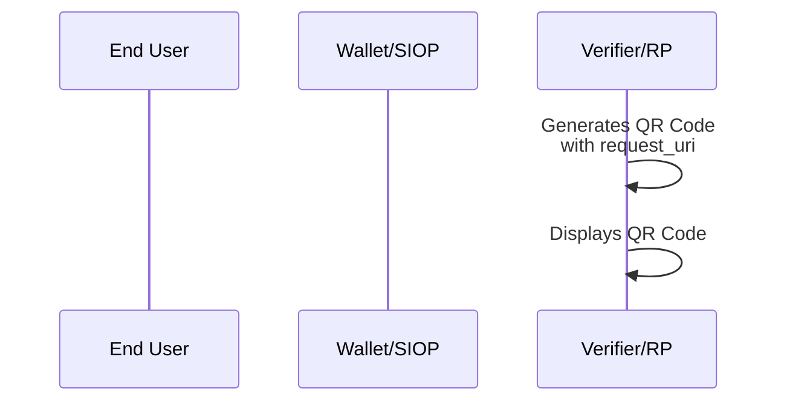
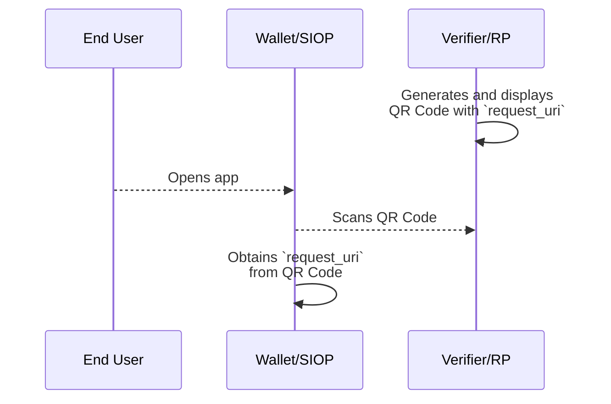
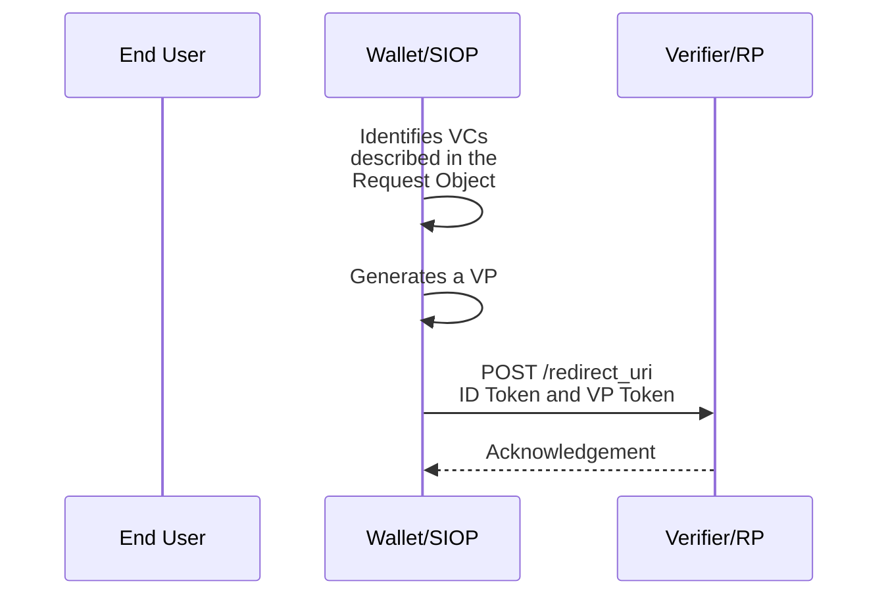

JWT VC Presentation Profile
==================

**Profile Status:** Draft

**Latest Draft:**
[https://identity.foundation/jwt-vc-presentation-profile](https://identity.foundation/jwt-vc-presentation-profile)

Editors:
~ [Daniel McGrogan](www.linkedin.com/in/dtmcgrogan) (Workday)
~ [Kristina Yasuda](https://www.linkedin.com/in/kristina-yasuda-6263b5a2) (Microsoft)
~ [Jen Schreiber](https://www.linkedin.com/in/jischr/) (Workday)

Contributors:
~ Tobias Looker (Mattr)
~ Andrew Hughes (Ping Identity)
~ David Waite (Ping Identity)
~ Valerie Lanard (Workday)
~ Daniel Godbout (Microsoft)
~ Rohit Gulati (Microsoft)
~ Eric Kuhn (Kraken)
~ Jeremie Miller (Ping Identity)
~ Oliver Terbu (Spruce)

Participate:
~ [GitHub repo](https://github.com/decentralized-identity/jwt-vc-presentation-profile)
~ [File a bug](https://github.com/decentralized-identity/jwt-vc-presentation-profile/issues)
~ [Commit history](https://github.com/decentralized-identity/jwt-vc-presentation-profile/commits/main)

------------------------------------

## Abstract

The JWT VC Presentation Profile defines a set of requirements against existing specifications to enable the interoperable presentation of Verifiable Credentials (VCs) between Wallets and Verifiers.

This document is not a specification, but a **profile**. It outlines existing specifications required for implementations to interoperate among each other. It also clarifies mandatory to implement features for the optionalities mentioned in the referenced specifications.

The profile uses OpenID for Verifiable Presentations ([[ref: OpenID4VP ID1]]) as the base protocol for the request and verification of W3C JWT VCs as W3C Verifiable Presentations ([[ref: VC Data Model v1.1]]). A full list of the open standards used in this profile can be found in [Overview of the Open Standards Requirements](#overview-of-the-open-standards-requirements).

### Audience

The audience of the document includes Verifiable Credential implementers and/or enthusiasts. The first few sections give an overview of the problem area and profile requirements for JWT VC interoperability. Subsequent sections are detailed and technical, describing the protocol flow and request-responses.

## Status of This Document

The status of the JWT VC Presentation Profile v0.1.0 is a DRAFT specification under development within the Decentralized Identity Foundation (DIF).

### Description

The [[ref: VC Data Model v1.1]] specification defines the data model of Verifiable Credentials (VCs) but does not prescribe standards for transport protocol, key management, authentication, query language, etc. As a result, if implementers decide which standards to use for their implementations on their own, there is no guarantee that other companies will also support the same set of standards.

This document aims to provide a path to interoperability by standardizing the set of specifications that enable the presentation of JWT VCs between implementers. Future versions of this document will include details on issuance and Wallet interoperability. Ultimately, this profile will define a standardized approach to Verifiable Credentials so that distributed developers, apps, and systems can share credentials through common means.


### Scope

#### Scope

This document is currently scoped for the presentation of VCs between the Wallet and the Verifier. The Wallet is a native mobile application. The following aspects are in scope:

- Data model
- Protocol to request presentation of VCs, including query language
- User authentication layer using Self-Issued ID Token
- Mechanism to establishing trust in the DID via Domain Linkage
- Identifiers of the entities
- Revocation of VCs
- Crypto suites

#### Out of Scope

The following items are out of scope for the current version of this document:
- Issuance of the VCs
- Advanced concepts in the [[ref: VC Data Model v1.1]]: `credentialSchema` (`credentialType` is used instead), `refreshService`, `termsOfUse`, `evidence`, and Disputes.
- Selective disclosure and unlinkability
- Zero-Knowledge Proofs
- Non-native Wallets like web applications, PWAs, etc.

Note: Although selective disclosure and unlinkability are out of scope of this document, future versions will consider Selective Disclosure for JWTs ([[ref: SD-JWT]]), JSON Web Proofs ([[ref: JWP]]) and JSON Web Algorithms ([[ref: JWA]]) once they mature in IETF.

## Structure of this Document

First, this profile outlines open standards required to be supported. Than, it describes detailed requirements for each specification.

## Terminology

This section consolidates in one place common terms used across open standards that this profile consists of. For the details of these, as well as other useful terms, see text within each of the specification listed in [[ref: References]].

[[def:Authorization Request]]
~ OAuth 2.0 Authorization Request extended by [[ref: OpenID4VP]] and [[ref: SIOPv2]].

[[def:Authorization Response]]
~ OAuth 2.0 Authorization Response extended by [[ref: OpenID4VP]] and [[ref: SIOPv2]].

[[def: Decentralized Identifier, DID]]
~ An identifier with its core ability being enabling Clients to obtain key material and other metadata by reference, defined in [[ref: DID Core]]. 

[[def: Holder]]
~ An entity that possesses or holds Verifiable Credentials and can generate Verifiable Presentations from them as defined in [[ref: VC Data Model v1.1]].

[[def:End User]]
~ Human Participant.

[[def: OpenID Provider (OP)]]
~ OAuth 2.0 Authentication Server implementing [[ref: OpenID Connect Core]] and [[ref: OpenID4VP]]

[[def: Presentation]] 
~ Data derived from one or more Verifiable Credentials, issued by one or more issuers, that is shared with a Verifier.

[[def: Relying Party (RP)]]
~ OAuth 2.0 Client application using [[ref: OpenID Connect Core]] and [[ref: OpenID4VP]] in [[ref: SIOPv2]]. Synonymous with term Verifier.

[[def:Request Object]]
~ JWT that contains a set of Authorization Request parameters as its Claims.

[[def: Self-Issued OpenID Provider (Self-Issued OP)]]  
~ An OpenID Provider (OP) used by an End User to prove control over a cryptographically verifiable identifier such as a DID.

[[def: Verifiable Credential (VC)]]
~ A set of one or more Claims made by an issuer that is tamper-evident and has authorship that can be cryptographically verified.

[[def: Verifiable Presentation (VP)]] 
~ A Presentation that is tamper-evident and has authorship that can be cryptographically verified.

[[def: Verifier]]
~ An entity that receives one or more Verifiable Credentials inside a Verifiable Presentation for processing. During presentation of Credentials, Verifier acts as an OAuth 2.0 Client towards the Wallet that is acting as an OAuth 2.0 Authorization Server. The Verifier is a specific case of OAuth 2.0 Client, just like Relying Party (RP) in [[ref: OpenID Connect Core]].

[[def: Issuer]]
~ An entity that issues Verifiable Credentials.

[[def: Wallet]]
~ An entity that receives, stores, presents, and manages credentials and key material of the End User. During presentation of VP(s) using [[ref: OpenID4VP]], the Wallet acts as an OAuth 2.0 Authorization Server towards the Verifier that is acting as an OAuth 2.0 Client. During user authentication using [[ref: SIOPv2]], the Wallet acts as a Self Issued OpenID Provider towards the Verifier that is a specific case of the Relying Party in [[ref: OpenID Connect Core]]. 

## Profile

### The Protocol Flow

This section briefly describes the end to end flow. Concepts and terms mentioned here will be described in more detail in subsequent sections of this document.

The flow begins as the Verifier generates a QR Code that contains a `request_uri` parameter which allows Self-Issued OP (SIOP) Request to be passed by reference. Verifier displays this QR code on their Verifier Website to initiate the exchange.




Verifier Website presents the QR Code to the End User on their Verifier Website. The End User scans the QR Code using their Wallet. The Wallet parses the QR code to obtain the `request_uri`.

The Wallet sends a GET request to the obtained `request_uri` to retrieve the Request Object. The Request Object is a signed JWT that contains a set of Authorization Request parameters as defined in [[ref: SIOPv2 ID1]] and [[ref: OpenID4VP ID1]]. In particular, Wallet will determine which VCs to submit to the Verifier by processing `presentation_definition` property in the Request Object.



Upon receiving the Request Object, the Wallet will identify VCs that satisfy the Presentation Definition and encapsulate them in a Verifiable Presentation (VP). The Wallet will complete the SIOP or Authorization Response by sending an ID Token and a VP Token to the Verifier's `redirect_uri`.

Upon receiving the ID Token and VP Token, Verifier performs necessary checks as described in the section [[ref:Validation of Authorization Response]] and sends an acknowledgement of receipt back to the Wallet as a 200 HTTP response status code. The flow of the Wallet presenting VCs to the Verifier is now complete.



### Open Standards Requirements

- VCs MUST adhere to the [[ref: VC Data Model v1.1]] and be encoded as JSON and signed as JWT as defined in 6.3.1 of [[ref: VC Data Model v1.1]]. VCs encoded as JSON-LD and signed using Linked Data Proofs are NOT supported.
- For key management and authentication, First Implementer's Draft of Self-Issued OpenID Connect Provider v2, an extension to OpenID Connect, MUST be used as defined in [[ref: SIOPv2 ID1]].
- For transportation of VCs, First Implementer's Draft of OpenID for Verifiable Presentations MUST be used as defined in [[ref: OpenID4VP ID1]].
- As the query language, [[ref: Presentation Exchange v1.0.0]] MUST be used and conform to the syntax defined in [[ref: OpenID4VP ID1]].
- Decentralized Identifiers (DIDs), as defined in [[ref: DID Core]], MUST be used as identifiers of the entities. Implementations MUST support did:web and did:ion as a mandatory DID method as defined in [[ref: did-web]] and [[ref: did-ion]].
- DID Documents MUST use either `JsonWebKey2020` or `EcdsaSecp256k1VerificationKey2019` as the type for Verification Material intended for use in the profile. ([[ref: DID Core]] section 5.2.1)
- Verification Material intended for use in the profile MUST use `publicKeyJwk` ([[ref: DID Core]] section 5.2.1).  The keys MUST be secp256k1 or Ed25519, see the _Cryptographic Signature_ section.
- DID Documents may contain Verification Material not intended for use with this profile of any Verification Material Type and any key format or algorithm.
- To bind an owner of a DID to a controller of a certain origin, a Well Known DID Configuration MUST be used as defined in [[ref: Well Known DID]].
- For Revocation of VCs, Status List 2021 as defined in [[ref: Status List 2021 (0.0.1 Predraft)]] MUST be discovered using either DID Relative URLs stored in an Identity Hub as defined in [[ref: Identity Hub (0.0.1 Predraft)]] or discovered using an HTTPS URL.

This profile uses certain versions of specifications that have not yet reached final status: For more details see [Normative References](#normative-references) section.

  - First Implementer's Draft of Self-Issued OpenID Provider v2 specification
  - First Implementer's Draft of OpenID for Verifiable Prensetations specification
  - ID Hub specification published as a v0.0.1 predraft of [[ref: Decentralized Web Node]]. Throughout the document, the term ID Hub, rather than Decentralized Web Node, will be used to avoid confusion.

The JWT VC Presentation Profile currently only supports response mode `direct_post` defined in [[ref: OpenID4VP ID1]], sending Authorization Response as HTTP POST request.

It is important to note that Cross-device SIOP is susceptible to a session phishing attack, where an attacker relays the Authorization Request from a good Verifier/RP to a victim and is able to sign in as a victim. Implementers MUST implement mitigations most suitable to the use-case. For more details and concrete mitigations, see section 15 Security Considerations in [[ref: SIOPv2 ID1]].

### JWT VCs

#### Using JWT claims instead of their counterparts in the data model specification

Section 6.3.1 of [[ref: VC Data Model v1.1]] provides two options for how to encode properties defined in VC Data Model v1.1 as a JWT:
  1. Use registered JWT claims instead of respective counterparts defined in a VC Data Model v1.1.
  2. Use JWT claims in addition to VC Data Model v1.1 counterparts

For the purpose of this profile, registered JWT claims `exp`, `iss`, `nbf`, `jti`, `sub` and `aud` MUST be used in a JWT VC instead of their respective counterparts defined in VC Data Model v1.1.

#### Base64url Encoding of a JWT encoded VC included in a VP

Verifiable Credentials included in a JWT-encoded Verifiable Presentation MUST be Base64url encoded. 

Base64url encoding is defined as a base64 encoding using the URL and filename safe character set defined in Section 5 of RFC4648, with all trailing '=' characters omitted (as permitted by Section 3.2 of RFC4648) and without the inclusion of any line breaks, whitespace, or other additional characters. Note that the base64url encoding of the empty octet sequence is the empty string. (See Appendix C of RFC7515 for notes on implementing base64url encoding without padding.)

#### `exp` JWT Claim

`exp` JWT claim in JWT encoded VC or VP MUST be used to set the value of the "expirationDate" of the VC or VP, and not of the credentialSubject.

#### `nbf` JWT Claim

[[ref: VC Data Model v1.1]] specifies that "issuanceDate" property MUST be represented as an `nbf` JWT claim, and not `iat` JWT claim. This might sound couterintuitive, but the implementers of this profile MUST follow this guidance.

#### `kid` JOSE header
When absolute DID URL is used as a `kid`, DID value in a `kid` without a DID fragment MUST exactly match a DID included in a `iss` if it is a VC or a VP and `sub` if it is an ID Token.

DID fragment in a `kid` identifies which key material in a DID Document to use to validate the signature on a VC/VP/ID Token. 

::: note
VCs issued with this profile currently use an absolute DID URL.
However, the requirement to use relative over absolute DID URLs within the `kid` header is currently under discussion due to better security features.

Future versions of the specifications or profile may update this guidance and requirements for the `kid` header. 
Due to this discussion (and the potential for transition), implementors are advised to consider accepting both absolute and relative DID URLs.

When relative DID URL is used as a `kid`, `kid` only contains a DID fragment of a DID included in a `iss` if it is a VC or a VP and `sub` if it is an ID Token. 
:::

### Authorization Request

[[ref: SIOPv2 ID1]] MUST be used for key management and authentication, [[ref: OpenID4VP ID1]] MUST be used to transport Verifiable Credentials, and [[ref: Presentation Exchange v1.0.0]] MUST be used as a query language as defined in [[ref: OpenID4VP ID1]].

#### Invoking the Wallet

Custom URL Scheme `openid-vc://` MUST be used to invoke Self-Issued OP.

#### Authorization Request URI

Request object shall be passed by reference, rather than by value, as defined in Section 6.2 of [[ref: OpenID Connect Core]]. The Holder Wallet retrieves full Request Object value from the resource at the `request_uri`.

There are multiple ways for a Verifier/RP to communicate `request_uri` to the Self-Issued OP. `request_uri` can be obtained from a QR code when Self-Issued OP is on a different device than the one on which the user interaction is occurring. It can also be obtained from a deep link when Self-Issued OP is on the same device as the one on which the user interaction is occurring.

The Self-Issued OP Request URI has an `openid` scheme.

The `request_uri` parameter is a HTTP URL from where the Holder Wallet can retrieve a full Request Object.

The Holder Wallet will retrieve the Request Object value from the `request_uri` as defined in section 6 of [[ref: OpenID Connect Core]].

The Authorization Request URI MUST include the following parameter:
* `request_uri`
  * REQUIRED. URL where Request Object value can be retrieved from, as specified in section 6.2 of [[ref: OpenID Connect Core]].

Below is a non-normative example of a Self-Issued OP URI and a QR Code which contains the encoded URI:

```uri
openid-vc://?request_uri=https://someverifierdomain.com/v1.0/verifiablecredentials/request/a0eed079-672f-4055-a4f5-e0f5d76ecdea
```


#### Self-Issued OP Request Object

Upon receipt of the Request, the Holder Wallet MUST send an HTTP GET request to the `request_uri` to retrieve the referenced Request Object, unless it is already cached, and parse it to recreate the Request parameters.

The response body to that HTTP GET request MUST be an encoded JWT. The media type MUST be `application/jwt`

Below is a non-normative unencoded example of a retrieved Request Object:

::: example Non-Normative Request Object
```json
[[insert: ./spec/assets/3_siopv2_request.json]]
```
:::

##### Self-Issued OP Request Parameters

The Self-Issued OP request object obtained via request_uri MUST include the following parameters and values:

* `scope`
  * REQUIRED. MUST be `openid`.
* `response_type`
  * REQUIRED. MUST be `id_token`.
* `response_mode`
  * REQUIRED. MUST be `post`. Self-Issued OP Response will be sent as an HTTP POST request.
* `client_id`
  * REQUIRED. MUST be a DID of a Verifier/RP.
* `redirect_uri`
  * REQUIRED. URI where the response will be sent.
* `nonce`
  * REQUIRED. String value used to associate a Client session with an ID Token, and to mitigate replay attacks, as specified in section 3.1.2.1. of [[ref: OpenID Connect Core]].


##### Self-Issued OP Discovery

The Verifier/RP MUST use static Self-Issued OP metadata as defined in section 6.2.1 of [[ref: SIOPv2 ID1]].

::: example SIOP Metatdata
```json
[[insert: ./spec/assets/1_siop_metadata.json]]
```
:::

##### Verifier/RP Registration Metadata

The Self-Issued OP request MUST be signed. Decentralized Identifier resolution as defined in section 10.2.2.2. of [[ref: SIOPv2 ID1]] MUST be used as the Verifier/RP Registration Metadata Resolution Method.

The RP MUST support Subject Syntax Type as specified in section 9.2.3 and include the DID methods required by this profile. in [[ref: SIOPv2 ID1]]. RP's `client_id` MUST be expressed using a DID method URI (of a DID method supported by this profile), and the public key used to sign the request MUST be obtained from the `verificationMethod` property of a DID Document. The public key used to sign the request in question MUST be identified by the `kid` in the header of the signed request.

All RP metadata other than the public key MUST be obtained from the `registration` parameter as defined in section 6.3.1. of [[ref: SIOPv2 ID1]].

The following are Verifier/RP Registration Metadata parameters and values:
* `subject_syntax_types_supported`
  * REQUIRED. MUST include the DID methods required by this profile (`did:ion`, `did:web`). Defined in [[ref: SIOPv2 ID1]].
* `vp_formats`
  * REQUIRED. MUST include `jwt_vp` and `jwt_vc`, and support signature algorithms `ES256K` and `EdDSA`. Defined in [[ref: OpenID4VP ID1]].
* `client_name`
  * OPTIONAL. Name of the Verifier/RP to be displayed to the End-User. If present, the server SHOULD display this name to the End-User during approval. Defined in [[ref: OIDC Registration]]. If desired, representation of this Claim in different languages and scripts is represented as described in Section 2.1 of [[ref: OIDC Registration]].
* `logo_uri`
  * OPTIONAL. URL that references a logo for the Verifier/RP application. If present, the server SHOULD display this image to the End-User during approval. The value of this field MUST point to a valid image file. Defined in [[ref: OIDC Registration]]. If desired, representation of this Claim in different languages and scripts is represented as described in Section 2.1 of [[ref: OIDC Registration]].
* `client_purpose`
  * OPTIONAL. The reason why the Verifier/RP is requesting the user to present a certain credential. If present, the server SHOULD display this purpose to the End-User during approval. Defined in this document.

Below is a normative example of claims included in the `registration` parameter:

::: example
```json
{
  "subject_syntax_types_supported": [
    "did:web",
    "did:ion"
  ],
  "vp_formats": {
    "jwt_vp": {
      "alg": [
        "ES256K",
        "EdDSA"
      ]
    },
    "jwt_vc": {
      "alg": [
        "ES256K",
        "EdDSA"
      ]
    }
  },
  "client_name": "Interop WG",
  "client_purpose": "Please share this information with us to get access to our library."
}
```
:::

Other Registration parameters defined in [[ref: OIDC Registration]] can be used.

##### Linked Domain Verification

To strengthen trust between the Verifier/RP and End-user, a Verifier/RP's DID MUST be bound to its website. This proves the Verifier/RP controls both the DID and the origin and allows the End-user to verify this relationship. To bind an owner of a DID to a controller of a certain origin, Well Known DID Configuration MUST be used as defined in [[ref: Well Known DID]].

Validation of Domain Linkage Credentials by the Wallet MUST follow the steps given in the [[ref: Well Known DID]] specification. To check validity of the Domain Linkage Credential, expiration property MUST be taken into account. Additional checks, e.g. of revocation, are not required by this profile. Since the Verifier/RP manages Domain Linkage Credentials and directly updates the DID Configuration Resource, the usage of a credentialStatus property for revocation in a Domain Linkage Credential typically is of little use. 

When creating a Verifier/RP's DID, the domain linked to that DID MUST be included in a `serviceEndpoint` property of the DID Document as shown in a non-normative response below:

::: example
```json
{
  "service": [
    {
      "id": "#domain-1",
      "type": "LinkedDomains",
      "serviceEndpoint": "https://vcsatoshi.com"
    }
  ]
}
```
:::
Prior to generating an Authorization Request, the Verifier/RP MUST create a Domain Linkage Credential in a JSON Web Token format. It MUST be included on the website via `/.well-known/did-configuration.json`.

Below is a non-normative example of a Domain Linkage Credential that is hosted at `https://www.vcsatoshi.com/.well-known/did-configuration.json`:

::: example Domain Linkage Credential
```json
[[insert: ./spec/assets/2_domain_linkage_credential.json]]
```
:::

##### Requesting Verifiable Credentials

A Specific VC type MUST be requested using [[ref: Presentation Exchange v1.0.0]] syntax in the Self-Issued OP request as defined in section 8 of [[ref: OpenID4VP ID1]]. `presentation_definition` property defined in [[ref: Presentation Exchange v1.0.0]] MUST be included in a `vp_token` property as defined in [[ref: OpenID4VP ID1]], which MUST be included in a `claims` parameter defined in [[ref: OpenID Connect Core]].

Below is a non-normative example of a `claims` parameter:
```json
{
  "claims": {
    "vp_token": {
      "presentation_definition": {
        "id": "c278823a-f9d7-4a22-9a73-4a1bcd87f60e",
        "input_descriptors": [
          {
            "id": "InteropExampleVC",
            "name": "InteropExampleVC",
            "purpose": "We need to verify that you have a valid InteropExampleVC Verifiable Credential.",
            "schema": [
              {
                "uri": "InteropExampleVC"
              }
            ]
          }
        ]
      }
    }
  }
}
```

### End-user Consent

When the Self-Issued OP displays the consent screen to the user, it is RECOMMENDED to display the domain name obtained using as defined in [Linked Domain Verification](#linked-domain-verification). Displaying details of the consent using registration parameters such as `client_name`, `logo_uri`, and `client_purpose` defined in [Registration Metadata](#verifierrp-registration-metadata) is OPTIONAL.

Note that displaying the domain name of the Verifier/RP helps the End-users to identify malicious Verifiers/RPs who has copied registration parameters of good Verifiers/OP and are impersonating them.

### Authorization Response

Authorization Response is sent as an HTTPS POST request to the RP's endpoint indicated in `redirect_uri` in the request.

Note that when this response_mode is used, the user will finish the transaction on the device with a Self-Issued OP, which is a different device than on which the user initiated a request. It is up to the implementations to enable further user interaction with the Verifier/RP on the device used to initiate the request.

### Structure of Authorization Response

Since requested VCs are returned in a VP Token, two artifacts MUST be returned:

1. ID Token that serves as an authentication receipt and includes metadata about the VP Token
1. VP Token that includes one or more Verifiable Presentations

`presentation_submission` object located inside an ID Token specifies metadata such as format and path of both VPs and VCs in the VP Token.

This profile currently supports including only a single VP in the VP Token. In such cases, as defined in section 5.2 of [[ref: OpenID4VP ID1]], when the Self-Issued OP returns a single VP in the `vp_token`, VP Token is not an array, and a single VP is passed as a `vp_token`. In this case, the descriptor map would contain a simple path expression "$".

Note that when in the future use-cases multiple VPs are included in the VP Token, VP Token itself is not signed, and each VP included inside the VP Token MUST be signed.

This profile currently assumes that ID Token and a single VP passed as a VP Token are signed by the same Holder DID.

Note that a Holder DID signing the ID Token in its `sub` claim is user's identifier within the RP/Verifier, while a Holder DID signing a VP in its `iss` claim is user's identifier within the Issuer, and the two do not have the same connotation.

#### [[def:Validation of Authorization Response]]

The following checks MUST be made by the Verifier upon receiving the Authorization Response. Verifiers MAY perform any additional checks according to their trust framework/policies.

##### ID Token Validation


Verifiers MUST go through (at least) the following steps and validate ID Token according to the rules defined in section 12.1 of [[ref: SIOPv2 ID1]] before trusting/using any of the contents of an ID Token:

1. Ensure that `iss` claim is `https://self-issued.me/v2/openid-vc`.
2. Check that the DID value in the `kid` and `sub` claims exactly match.
3. Validate the signature on the ID Token. Validation is performed against the key obtained from a DID Document. DID Document MUST be obtained by resolving a Decentralized Identifier included in the `sub` claim using DID Resolution. If a DID Doc contains multiple keys, kid in the header is used to identify which key to use.
4. Check that `sub` claim equal the value of the `id` property in the DID Document obtained in step 3.
5. Check that the `_vp_token` claim is present and contains a `presentation_submission` with a valid descriptor map.

##### VP Token Validation

Verifiers MUST go through (at least) the following steps before trusting/using any of the contents of a VP Token:

1. Determine the number of VPs returned in the VP Token and identify in which VP requested VC(s) are included, using the descriptor map obtained from the ID Token.
2. Check that the DID value in the `kid` and `iss` claims match in each of the VP(s).
3. Validate the signature of each of the VP(s) passed in the VP Token. Validation is performed against the key obtained from a DID Document. DID Document MUST be obtained by resolving a Decentralized Identifier included in the `iss` claim using DID Resolution. If a DID Doc contains multiple keys, kid in the header is used to identify which key to use.
4. Confirm that the VC meets all requested criteria using the mechanisms outlined in Section 4.3 of [[ref: Presentation Exchange v1.0.0]], using the Presentation Definition from the Authorization Request, i.e. credential format, type, JSON schema, etc.
5. Check that the DID value in the `kid` and `iss` claims match in each of the VC(s).
6. Validate signature(s) on each VC(s). Validation is performed against the key obtained from a DID Document. DID Document MUST be obtained by resolving a Decentralized Identifier included in the `iss` claim using DID Resolution. If a DID Doc contains multiple keys, kid in the header is used to identify which key to use.
7. Check that the DID value in the `iss` Claim of a VP exactly match with the `sub` Claim in the VC(s). (Holder Binding)
8. Perform the checks required by the Verifier's policy, based on the set of trust requirements such as trust frameworks it belongs to. The checks can include Linked Domain verification of the Credential Issuer's DID using the mechanism defined in [Linked Domain Verification](#linked-domain-verification) and Credential status validation of the VC(s) using the mechanism defined in [Revocation](#revocation).

#### ID Token example

Below is a non-normative example of an ID Token:
::: example ID Token
```json
[[insert: ./spec/assets/4_id_token.json]]
```
:::

#### VP Token example

Below is a non-normative example of a Base64URL encoded VP Token:
::: example  Base64URL Encoded VP Token
```json
[[insert: ./spec/assets/encoded_vptoken_jwt.json]]
```
:::

Below is a non-normative example of a decoded VP Token:
::: example  Decoded VP Token
```json
[[insert: ./spec/assets/6_decoded_vp_token.json]]
```
:::

Below is a non-normative example of a Base64URL encoded VC. Note that the VC MUST be obtained from `path_nested` in `presentation_submission` of the ID Token.
::: example  VC JWT
```json
[[insert: ./spec/assets/vc_jwt.json]]
```
:::

Below is a non-normative example of a decoded VC in a JSON format, signed as a JWT:
::: example  Decoded VC
```json
[[insert: ./spec/assets/sample_vc_1.json]]
```
:::

### Decentralized Identifiers

This profile utilizes Decentralized Identifiers (DIDs) as a cryptographically verifiable identifier of the Verifier/RP and Self-Issued OP and that resolve to cryptographic key material.

ION DIDs can operate in both long-form and short-form. Implementations of this profile MUST be able to consume both long-form and short-form DIDs regardless of whether they are anchored.

The Verifier/RP should always check DIDs against an ION node to validate their current states. Just because a long form DID has been used, doesn't mean the state hasn't changed on ION.

#### Short-Form DID

Short Form DIDs are DIDs written on a Bitcoin Blockchain. They are also known as anchored DIDs. These types of DIDs give the organization and user the most flexibility because the underlying components of the DID Document, such as public keys and service endpoints, can change without altering the DID itself.

Below is a non-normative example of a short-form DID:

```md
did:ion:EiDC8qe_kwtm02IVoVZ8epcGi90XnL1NYI6baJIwHVBgrg
```
Below is a non-normative example of a DID Document obtained by resolving a short-form DID using an ION Node:
::: example  Resolved SFD
```json
[[insert: ./spec/assets/resolved_short_form_did.json]]
```
:::

#### Long-Form DID

Long-form DIDs are DIDs not written on a Bitcoin Blockchain. They are also known as unanchored DIDs.

Long-form DIDs have the entire DID Document encapsulated into the DID itself. This means that public keys cannot be rotated without modifying a DID

Below is a non-normative example of a long-form DID:
::: example  LFD
```json
[[insert: ./spec/assets/raw_longform_did.json]]
```
:::

Below is a non-normative example of a DID Document obtained by resolving a long-form DID using an ION Node:
::: example  Resolved LFD
```json
[[insert: ./spec/assets/resolved_long_form_did.json]]
```
:::

#### serviceEndpoints

The following two serviceEndpoints MUST be supported in the DID Document, but only one is required.

1. LinkedDomain as defined in [[ref: Well Known DID]]
1. IdentityHub as defined in [[ref: Identity Hub (0.0.1 Predraft)]]

### Revocation

StatusList2021 MUST be used for revocation of VCs, as defined in [[ref: Status List 2021 (0.0.1 Predraft)]].

#### credentialStatus

The issued VC MAY include a `credentialStatus` property.

When `credentialStatus` is defined, it MUST use StatusList2021 , as defined in section 5.1 of [[ref: Status List 2021 (0.0.1 Predraft)]].

StatusList2021 MUST be discovered using either DID Relative URLs stored in an ID Hub or HTTPS URL. 

An Issuer of a VC MAY have an ID Hub serviceEndpoint in the Issuer's DID Document. ID Hubs are the single endpoint to look up objects associated with a DID, defined in [[ref: Identity Hub (0.0.1 Predraft)]].

Below is a non-normative example of a DID Document that includes a serviceEndpoint:

```json
"service": [
      {
        "id": "hubs",
        "type": "IdentityHub",
        "serviceEndpoint": [
          "https://hubs.microsoft.com",
          "https://datastore.protonmail.com"
        ]
      }
]
```

```json
{
  "credentialStatus": {
    "id": "Qmdfr32sdf32546...",
    "type": "RevocationList2021Status",
    "statusListIndex": "94567",
    "statusListCredential": 'did:ion:123?service=IdentityHub&relativeRef=?messages=[{ type: "CollectionsQuery", statement: { id: "Qmdfr32sdf32546..." }}]'
  }
}
```

### Cryptographic Signature

Verifiers and Wallets compliant with this profile MUST support JWT signature verification of the Key Types as defined in the table below:

|Key Type|JWT Algorithm|Support to validate the signature by the Verifier and the Wallet|Support to sign by the Wallet|
|--------|-------------|-------------|-------------|
|secp256k1|ES256K|M|C*|
|Ed25519|EdDSA|M|C*|
|P-256 (secp256r1)|ES256|M|C*|
|P-384 (secp384r1)|ES384|M|C*|

`C*` Conditional: MUST support at least one.
`M` Must: MUST support.

Note: This profile leverages JWT for signature generation and verification only. There is a rich offering of Linked Data Cryptographic Suites which are not covered by this iteration of the profile.
For reference and more information on LD signature suites see the [Linked Data Cryptographic Suite Registry](https://w3c-ccg.github.io/ld-cryptosuite-registry/).

## Credential type `VerifiedEmployee`

Below is a description of a `credentialSubject` for a credential type `VerifiedEmployee`. It is RECOMMENDED to be used with a Workplace Credential Use-Case defined below. However the usage of this credential type is OPTIONAL and is not required to be compliant with this profile.

- `displayName` REQUIRED. String. The name displayed for the user. This is usually the combination of the user's first name and last name. Maximum length is 256 characters.
- `givenName` OPTIONAL. String. The given name (first name) of the user. Maximum length is 64 characters.
- `surname`  OPTIONAL. String. The user's surname (family name or last name). Maximum length is 64 characters.
- `jobTitle` OPTIONAL. String. The user's job title. Maximum length is 128 characters.
- `preferredLanguage` OPTIONAL. String. The preferred language for the user. Should follow ISO 639-1 Code, for example en-US.
- `photo`  OPTIONAL. The user's profile photo. The data is binary and not encoded in base64.

```json
[[insert: ./spec/assets/workplace_credential_vc.json]]
```

## Security Considerations

It is important to note that Cross-device SIOP is susceptible to a session phishing attack, where an attacker relays the request from a good Verifier/RP to a victim and is able to sign in as a victim. Implementers MUST implement mitigations most suitable to the use-case. For more details and concrete mitigations, see section 15 Security Considerations in [[ref: SIOPv2 ID1]].

## Use-Cases

### Workplace Credential

Workplace credential refers to a use case scenario for Verifiable Credential, where it is issued to the user by its workplace organization. The user, in this case, could be an employee, student, staff, contractor, or vendor. It supports users’ journeys around Onboarding, access to workplace applications, and even Alumni access scenarios. The objective of workplace credentials is to: 

- Allow access to workplace applications – e.g. Verified Employee accessing their work email
- Allow access to workplace applications by partners – e.g. Verified Employee at Woodgrove collaborating at Fabrikam
- Allow access to applications on the Internet – e.g. Verified Employee at Woodgrove, unlocking a travel discount with an airline.

Below is a storyboard that explains one concrete scenario using a workplace credential.
- Alice Smith is a user at Woodgrove and her employer has issued her a workplace credential.
- Alice gets a notification email stating that she could get a workplace credential but launching the issuer portal interface.
- Alice uses her smartphone’s camera app or Authenticator app (Wallet app) to scan the QR Code shown on the portal.
- Alice is presented with an idtoken flow journey. She presents her corporate username and password credentials to complete the idtoken flow.
- Issuer service takes the claims from ID Token and presents Alice a Verifiable Credential that she can accept and store in her Wallet app.
- Alice can review the credential information and can also review the  activity report for this credential.


## Examples

Examples are listed inline in above sections as well as in complete form within [Test Vectors](#test-vectors).

## Implementations

- Microsoft
- Workday
- Mattr
- Ping Identity

## Testing

Implementations may test conformance of the Wallets to this profile using this [verification website](https://vcinteroptesting.azurewebsites.net/verifier).

## Test Vectors

The test vectors which follow are non-normative.

Each payload is consistent with the others in the section, but will not match any externally run system and should not be considered as supported or endorsed identity.

### Identifiers

The Private Key JWK and DID (long-form `did:ion`) of the Verifier, Wallet (Holder) and Credential Issuer are included below to generate/verify signatures.

These identities have been generated only as examples - they are not endorsed or anchored and do not contain a Linked Domain.

#### Verifier

<tab-panels selected-index="0">
  <nav>
    <button type="button">Private Key JWK</button>
    <button type="button">DID</button>
  </nav>
  <section>

  ```json
  {
    "key": {
      "kty" : "OKP",
      "d" : "SP18SnbU9f-Rph0GwulyvmLFyCXDHqZVKWDo2E41llQ",
      "crv" : "Ed25519",
      "kid" : "key-1",
      "x" : "C_OUJxH6iIcC6XdNh7JmC-THXAVaXnvu9OEEZ8tq9NI"
    }
  }
  ```
  </section>
  <section>

  ```json
  {
    "did": "did:ion:EiBWe9RtHT7VZ-Juff8OnnJAyFJtCokcYHx1CQkFtpl7pw:eyJkZWx0YSI6eyJwYXRjaGVzIjpbeyJhY3Rpb24iOiJyZXBsYWNlIiwiZG9jdW1lbnQiOnsicHVibGljS2V5cyI6W3siaWQiOiJrZXktMSIsInB1YmxpY0tleUp3ayI6eyJjcnYiOiJFZDI1NTE5Iiwia3R5IjoiT0tQIiwieCI6IkNfT1VKeEg2aUljQzZYZE5oN0ptQy1USFhBVmFYbnZ1OU9FRVo4dHE5TkkiLCJraWQiOiJrZXktMSJ9LCJwdXJwb3NlcyI6WyJhdXRoZW50aWNhdGlvbiJdLCJ0eXBlIjoiSnNvbldlYktleTIwMjAifV19fV0sInVwZGF0ZUNvbW1pdG1lbnQiOiJFaUNYTkJqSWZMVGZOV0NHMFQ2M2VaYmJEZFZoSmJUTjgtSmZlaUx4dW1oZW53In0sInN1ZmZpeERhdGEiOnsiZGVsdGFIYXNoIjoiRWlCZVZ5RXBDb0NPeXJ6VDhDSHlvQW1acU1CT1o0VTZqcm1sdUt1SjlxS0pkZyIsInJlY292ZXJ5Q29tbWl0bWVudCI6IkVpQnhkcHlyamlVSFZ1akNRWTBKMkhBUFFYZnNwWFBKYWluV21mV3RNcFhneFEifX0"
  }
  ```
  </section>
</tab-panels>

#### Wallet (Holder)

<tab-panels selected-index="0">
  <nav>
    <button type="button">Private Key JWK</button>
    <button type="button">DID</button>
  </nav>
  <section>

  ```json
  {
    "key":{
      "kty" : "OKP",
      "d" : "ZeDOVmemqzPAK0R2F1BHVfRYC7g65p_UpyXhEaX03N4",
      "crv" : "Ed25519",
      "kid" : "key-1",
      "x" : "w06OV7e6nTurt6G9VpVXxIwYnyjfupxeGyKBS-blqvg"
    }
  }
  ```
  </section>
  <section>

  ```json
  {
    "did" : "did:ion:EiAeM6No9kdpos6_ehBUDh4RINY4USDMh-QdWksmsI3WkA:eyJkZWx0YSI6eyJwYXRjaGVzIjpbeyJhY3Rpb24iOiJyZXBsYWNlIiwiZG9jdW1lbnQiOnsicHVibGljS2V5cyI6W3siaWQiOiJrZXktMSIsInB1YmxpY0tleUp3ayI6eyJjcnYiOiJFZDI1NTE5Iiwia3R5IjoiT0tQIiwieCI6IncwNk9WN2U2blR1cnQ2RzlWcFZYeEl3WW55amZ1cHhlR3lLQlMtYmxxdmciLCJraWQiOiJrZXktMSJ9LCJwdXJwb3NlcyI6WyJhdXRoZW50aWNhdGlvbiJdLCJ0eXBlIjoiSnNvbldlYktleTIwMjAifV19fV0sInVwZGF0ZUNvbW1pdG1lbnQiOiJFaUFSNGRVQmxqNWNGa3dMdkpTWUYzVExjLV81MWhDX2xZaGxXZkxWZ29seTRRIn0sInN1ZmZpeERhdGEiOnsiZGVsdGFIYXNoIjoiRWlEcVJyWU5fV3JTakFQdnlFYlJQRVk4WVhPRmNvT0RTZExUTWItM2FKVElGQSIsInJlY292ZXJ5Q29tbWl0bWVudCI6IkVpQUwyMFdYakpQQW54WWdQY1U5RV9POE1OdHNpQk00QktpaVNwT3ZFTWpVOUEifX0"
  }
  ```
  </section>
</tab-panels>

#### Credential Issuer

<tab-panels selected-index="0">
  <nav>
    <button type="button">Private Key JWK</button>
    <button type="button">DID</button>
  </nav>
  <section>

  ```json
  {
    "key": {
      "kty" : "OKP",
      "d" : "jGLXxgOFN5DuQQFrRBN58Xll5SRizDXyVL5uiDY60_4",
      "crv" : "Ed25519",
      "kid" : "key-1",
      "x" : "GgZGTg8eCa7lV28ML9JTmBUvk7DYBbfRKWLhw65Jo1s"
    }
  }
  ```
  </section>
  <section>

  ```json
  {
    "did" : "did:ion:EiBAA99TAezxKRc2wuuBnr4zzGsS2YcsOA4IPQV0KY64Xg:eyJkZWx0YSI6eyJwYXRjaGVzIjpbeyJhY3Rpb24iOiJyZXBsYWNlIiwiZG9jdW1lbnQiOnsicHVibGljS2V5cyI6W3siaWQiOiJrZXktMSIsInB1YmxpY0tleUp3ayI6eyJjcnYiOiJFZDI1NTE5Iiwia3R5IjoiT0tQIiwieCI6IkdnWkdUZzhlQ2E3bFYyOE1MOUpUbUJVdms3RFlCYmZSS1dMaHc2NUpvMXMiLCJraWQiOiJrZXktMSJ9LCJwdXJwb3NlcyI6WyJhdXRoZW50aWNhdGlvbiJdLCJ0eXBlIjoiSnNvbldlYktleTIwMjAifV19fV0sInVwZGF0ZUNvbW1pdG1lbnQiOiJFaURKV0Z2WUJ5Qzd2azA2MXAzdHYwd29WSTk5MTFQTGgwUVp4cWpZM2Y4MVFRIn0sInN1ZmZpeERhdGEiOnsiZGVsdGFIYXNoIjoiRWlBX1RvVlNBZDBTRWxOU2VrQ1k1UDVHZ01KQy1MTVpFY2ZSV2ZqZGNaYXJFQSIsInJlY292ZXJ5Q29tbWl0bWVudCI6IkVpRDN0ZTV4eFliemJod0pYdEUwZ2tZV3Z3MlZ2VFB4MU9la0RTcXduZzRTWmcifX0"
  }
  ```
  </section>
</tab-panels>

### QR Code

The QR Code is displayed on the Verifier's Website and contains the encoded Self-Issued OP URI.


### Self Issued OP Request URI

The Self Issued OP Request URI contains the request_uri. It is decoded by the Wallet.

```uri
openid-vc://?request_uri=https://example/service/api/v1/presentation-request/649d8c3c-f5ac-41bd-9c19-5804ea1b8fe9
```

### Request Object

The Wallet uses the request_uri to obtain the Request Object. The JWS is signed by the Verifier.

<tab-panels selected-index="0">
  <nav>
    <button type="button">Encoded JWS</button>
    <button type="button">Decoded JWS</button>
  </nav>
    <section>

  ```
  eyJraWQiOiJkaWQ6aW9uOkVpQldlOVJ0SFQ3VlotSnVmZjhPbm5KQXlGSnRDb2tjWUh4MUNRa0Z0cGw3cHc6ZXlKa1pXeDBZU0k2ZXlKd1lYUmphR1Z6SWpwYmV5SmhZM1JwYjI0aU9pSnlaWEJzWVdObElpd2laRzlqZFcxbGJuUWlPbnNpY0hWaWJHbGpTMlY1Y3lJNlczc2lhV1FpT2lKclpYa3RNU0lzSW5CMVlteHBZMHRsZVVwM2F5STZleUpqY25ZaU9pSkZaREkxTlRFNUlpd2lhM1I1SWpvaVQwdFFJaXdpZUNJNklrTmZUMVZLZUVnMmFVbGpRelpZWkU1b04wcHRReTFVU0ZoQlZtRllibloxT1U5RlJWbzRkSEU1VGtraUxDSnJhV1FpT2lKclpYa3RNU0o5TENKd2RYSndiM05sY3lJNld5SmhkWFJvWlc1MGFXTmhkR2x2YmlKZExDSjBlWEJsSWpvaVNuTnZibGRsWWt0bGVUSXdNakFpZlYxOWZWMHNJblZ3WkdGMFpVTnZiVzFwZEcxbGJuUWlPaUpGYVVOWVRrSnFTV1pNVkdaT1YwTkhNRlEyTTJWYVltSkVaRlpvU21KVVRqZ3RTbVpsYVV4NGRXMW9aVzUzSW4wc0luTjFabVpwZUVSaGRHRWlPbnNpWkdWc2RHRklZWE5vSWpvaVJXbENaVlo1UlhCRGIwTlBlWEo2VkRoRFNIbHZRVzFhY1UxQ1QxbzBWVFpxY20xc2RVdDFTamx4UzBwa1p5SXNJbkpsWTI5MlpYSjVRMjl0YldsMGJXVnVkQ0k2SWtWcFFuaGtjSGx5YW1sVlNGWjFha05SV1RCS01raEJVRkZZWm5Od1dGQktZV2x1VjIxbVYzUk5jRmhuZUZFaWZYMCNrZXktMSIsInR5cCI6IkpXVCIsImFsZyI6IkVkRFNBIn0.eyJyZXNwb25zZV90eXBlIjoiaWRfdG9rZW4iLCJub25jZSI6IjQwMjUyYWZjLTZhODItNGEyZS05MDVmLWU0MWYxMjJlZjU3NSIsImNsaWVudF9pZCI6ImRpZDppb246RWlCV2U5UnRIVDdWWi1KdWZmOE9ubkpBeUZKdENva2NZSHgxQ1FrRnRwbDdwdzpleUprWld4MFlTSTZleUp3WVhSamFHVnpJanBiZXlKaFkzUnBiMjRpT2lKeVpYQnNZV05sSWl3aVpHOWpkVzFsYm5RaU9uc2ljSFZpYkdsalMyVjVjeUk2VzNzaWFXUWlPaUpyWlhrdE1TSXNJbkIxWW14cFkwdGxlVXAzYXlJNmV5SmpjbllpT2lKRlpESTFOVEU1SWl3aWEzUjVJam9pVDB0UUlpd2llQ0k2SWtOZlQxVktlRWcyYVVsalF6WllaRTVvTjBwdFF5MVVTRmhCVm1GWWJuWjFPVTlGUlZvNGRIRTVUa2tpTENKcmFXUWlPaUpyWlhrdE1TSjlMQ0p3ZFhKd2IzTmxjeUk2V3lKaGRYUm9aVzUwYVdOaGRHbHZiaUpkTENKMGVYQmxJam9pU25OdmJsZGxZa3RsZVRJd01qQWlmVjE5ZlYwc0luVndaR0YwWlVOdmJXMXBkRzFsYm5RaU9pSkZhVU5ZVGtKcVNXWk1WR1pPVjBOSE1GUTJNMlZhWW1KRVpGWm9TbUpVVGpndFNtWmxhVXg0ZFcxb1pXNTNJbjBzSW5OMVptWnBlRVJoZEdFaU9uc2laR1ZzZEdGSVlYTm9Jam9pUldsQ1pWWjVSWEJEYjBOUGVYSjZWRGhEU0hsdlFXMWFjVTFDVDFvMFZUWnFjbTFzZFV0MVNqbHhTMHBrWnlJc0luSmxZMjkyWlhKNVEyOXRiV2wwYldWdWRDSTZJa1ZwUW5oa2NIbHlhbWxWU0ZaMWFrTlJXVEJLTWtoQlVGRllabk53V0ZCS1lXbHVWMjFtVjNSTmNGaG5lRkVpZlgwIiwicmVzcG9uc2VfbW9kZSI6InBvc3QiLCJuYmYiOjE2NzQ3NzIwNjMsInNjb3BlIjoib3BlbmlkIiwiY2xhaW1zIjp7InZwX3Rva2VuIjp7InByZXNlbnRhdGlvbl9kZWZpbml0aW9uIjp7ImlkIjoiNjQ5ZDhjM2MtZjVhYy00MWJkLTljMTktNTgwNGVhMWI4ZmU5IiwiaW5wdXRfZGVzY3JpcHRvcnMiOlt7ImlkIjoiVmVyaWZpZWRFbXBsb3llZVZDIiwibmFtZSI6IlZlcmlmaWVkRW1wbG95ZWVWQyIsInB1cnBvc2UiOiJXZSBuZWVkIHRvIHZlcmlmeSB0aGF0IHlvdSBoYXZlIGEgVmVyaWZpZWRFbXBsb3llZSBWZXJpZmlhYmxlIENyZWRlbnRpYWwuIiwic2NoZW1hIjpbeyJ1cmkiOiJWZXJpZmllZEVtcGxveWVlIn1dfV19fX0sInJlZ2lzdHJhdGlvbiI6eyJjbGllbnRfbmFtZSI6IkV4YW1wbGUgVmVyaWZpZXIiLCJ0b3NfdXJpIjoiaHR0cHM6XC9cL2V4YW1wbGUuY29tXC92ZXJpZmllci1pbmZvIiwibG9nb191cmkiOiJodHRwczpcL1wvZXhhbXBsZS5jb21cL3ZlcmlmaWVyLWljb24ucG5nIiwic3ViamVjdF9zeW50YXhfdHlwZXNfc3VwcG9ydGVkIjpbImRpZDppb24iXSwidnBfZm9ybWF0cyI6eyJqd3RfdnAiOnsiYWxnIjpbIkVkRFNBIiwiRVMyNTZLIl19LCJqd3RfdmMiOnsiYWxnIjpbIkVkRFNBIiwiRVMyNTZLIl19fX0sInN0YXRlIjoiNjQ5ZDhjM2MtZjVhYy00MWJkLTljMTktNTgwNGVhMWI4ZmU5IiwicmVkaXJlY3RfdXJpIjoiaHR0cHM6XC9cL2V4YW1wbGUuY29tXC9zaW9wLXJlc3BvbnNlIiwiZXhwIjoxNjc0Nzc1NjYzLCJpYXQiOjE2NzQ3NzIwNjMsImp0aSI6ImYwZTZkY2Y1LTNmZTYtNDUwNy1hZGM5LWI0OTZkYWYzNDUxMiJ9.znX9h8l8JYoy8BHlnZzRDBEpaAv3hkb_XfUEzG-9eZID3tJjJdrO7PAr4kTay-nxvMhkzNsQg1rCZsjOMbKbBg
  ```
  </section>
  <section>

  ```json
    {
      "kid" : "did:ion:EiBWe9RtHT7VZ-Juff8OnnJAyFJtCokcYHx1CQkFtpl7pw:eyJkZWx0YSI6eyJwYXRjaGVzIjpbeyJhY3Rpb24iOiJyZXBsYWNlIiwiZG9jdW1lbnQiOnsicHVibGljS2V5cyI6W3siaWQiOiJrZXktMSIsInB1YmxpY0tleUp3ayI6eyJjcnYiOiJFZDI1NTE5Iiwia3R5IjoiT0tQIiwieCI6IkNfT1VKeEg2aUljQzZYZE5oN0ptQy1USFhBVmFYbnZ1OU9FRVo4dHE5TkkiLCJraWQiOiJrZXktMSJ9LCJwdXJwb3NlcyI6WyJhdXRoZW50aWNhdGlvbiJdLCJ0eXBlIjoiSnNvbldlYktleTIwMjAifV19fV0sInVwZGF0ZUNvbW1pdG1lbnQiOiJFaUNYTkJqSWZMVGZOV0NHMFQ2M2VaYmJEZFZoSmJUTjgtSmZlaUx4dW1oZW53In0sInN1ZmZpeERhdGEiOnsiZGVsdGFIYXNoIjoiRWlCZVZ5RXBDb0NPeXJ6VDhDSHlvQW1acU1CT1o0VTZqcm1sdUt1SjlxS0pkZyIsInJlY292ZXJ5Q29tbWl0bWVudCI6IkVpQnhkcHlyamlVSFZ1akNRWTBKMkhBUFFYZnNwWFBKYWluV21mV3RNcFhneFEifX0#key-1",
      "typ" : "JWT",
      "alg" : "EdDSA"
    }.
    {
      "response_type" : "id_token",
      "nonce" : "40252afc-6a82-4a2e-905f-e41f122ef575",
      "client_id" : "did:ion:EiBWe9RtHT7VZ-Juff8OnnJAyFJtCokcYHx1CQkFtpl7pw:eyJkZWx0YSI6eyJwYXRjaGVzIjpbeyJhY3Rpb24iOiJyZXBsYWNlIiwiZG9jdW1lbnQiOnsicHVibGljS2V5cyI6W3siaWQiOiJrZXktMSIsInB1YmxpY0tleUp3ayI6eyJjcnYiOiJFZDI1NTE5Iiwia3R5IjoiT0tQIiwieCI6IkNfT1VKeEg2aUljQzZYZE5oN0ptQy1USFhBVmFYbnZ1OU9FRVo4dHE5TkkiLCJraWQiOiJrZXktMSJ9LCJwdXJwb3NlcyI6WyJhdXRoZW50aWNhdGlvbiJdLCJ0eXBlIjoiSnNvbldlYktleTIwMjAifV19fV0sInVwZGF0ZUNvbW1pdG1lbnQiOiJFaUNYTkJqSWZMVGZOV0NHMFQ2M2VaYmJEZFZoSmJUTjgtSmZlaUx4dW1oZW53In0sInN1ZmZpeERhdGEiOnsiZGVsdGFIYXNoIjoiRWlCZVZ5RXBDb0NPeXJ6VDhDSHlvQW1acU1CT1o0VTZqcm1sdUt1SjlxS0pkZyIsInJlY292ZXJ5Q29tbWl0bWVudCI6IkVpQnhkcHlyamlVSFZ1akNRWTBKMkhBUFFYZnNwWFBKYWluV21mV3RNcFhneFEifX0",
      "response_mode" : "post",
      "nbf" : 1674772063,
      "scope" : "openid",
      "claims" : {
        "vp_token" : {
          "presentation_definition" : {
            "input_descriptors" : [ {
              "schema" : [ {
                "uri" : "VerifiedEmployee"
              } ],
              "purpose" : "We need to verify that you have a valid VerifiedEmployee Verifiable Credential.",
              "name" : "VerifiedEmployeeVC",
              "id" : "VerifiedEmployeeVC"
            } ],
            "id" : "649d8c3c-f5ac-41bd-9c19-5804ea1b8fe9"
          }
        }
      },
      "registration" : {
        "logo_uri" : "https://example.com/verifier-icon.png",
        "tos_uri" : "https://example.com/verifier-info",
        "client_name" : "Example Verifier",
        "vp_formats" : {
          "jwt_vc" : {
            "alg" : [ "EdDSA", "ES256K" ]
          },
          "jwt_vp" : {
            "alg" : [ "EdDSA", "ES256K" ]
          }
        },
        "subject_syntax_types_supported" : [ "did:ion" ]
      },
      "state" : "649d8c3c-f5ac-41bd-9c19-5804ea1b8fe9",
      "redirect_uri" : "https://example.com/siop-response",
      "exp" : 1674775663,
      "iat" : 1674772063,
      "jti" : "f0e6dcf5-3fe6-4507-adc9-b496daf34512"
    }.
    [signature]
  ```
  </section>
</tab-panels>

### Authorization Response

The Wallet sends the Authorization Response back to the Verifier. The JWS is signed by the Wallet.

<tab-panels selected-index="0">
  <nav>
    <button type="button">Authorization Response</button>
    <button type="button">Decoded ID Token</button>
    <button type="button">Decoded VP Token</button>

  </nav>
  <section>

  ```json
    {
      "state" : "649d8c3c-f5ac-41bd-9c19-5804ea1b8fe9",
      "id_token" : "eyJraWQiOiJkaWQ6aW9uOkVpQWVNNk5vOWtkcG9zNl9laEJVRGg0UklOWTRVU0RNaC1RZFdrc21zSTNXa0E6ZXlKa1pXeDBZU0k2ZXlKd1lYUmphR1Z6SWpwYmV5SmhZM1JwYjI0aU9pSnlaWEJzWVdObElpd2laRzlqZFcxbGJuUWlPbnNpY0hWaWJHbGpTMlY1Y3lJNlczc2lhV1FpT2lKclpYa3RNU0lzSW5CMVlteHBZMHRsZVVwM2F5STZleUpqY25ZaU9pSkZaREkxTlRFNUlpd2lhM1I1SWpvaVQwdFFJaXdpZUNJNkluY3dOazlXTjJVMmJsUjFjblEyUnpsV2NGWlllRWwzV1c1NWFtWjFjSGhsUjNsTFFsTXRZbXh4ZG1jaUxDSnJhV1FpT2lKclpYa3RNU0o5TENKd2RYSndiM05sY3lJNld5SmhkWFJvWlc1MGFXTmhkR2x2YmlKZExDSjBlWEJsSWpvaVNuTnZibGRsWWt0bGVUSXdNakFpZlYxOWZWMHNJblZ3WkdGMFpVTnZiVzFwZEcxbGJuUWlPaUpGYVVGU05HUlZRbXhxTldOR2EzZE1ka3BUV1VZelZFeGpMVjgxTVdoRFgyeFphR3hYWmt4V1oyOXNlVFJSSW4wc0luTjFabVpwZUVSaGRHRWlPbnNpWkdWc2RHRklZWE5vSWpvaVJXbEVjVkp5V1U1ZlYzSlRha0ZRZG5sRllsSlFSVms0V1ZoUFJtTnZUMFJUWkV4VVRXSXRNMkZLVkVsR1FTSXNJbkpsWTI5MlpYSjVRMjl0YldsMGJXVnVkQ0k2SWtWcFFVd3lNRmRZYWtwUVFXNTRXV2RRWTFVNVJWOVBPRTFPZEhOcFFrMDBRa3RwYVZOd1QzWkZUV3BWT1VFaWZYMCNrZXktMSIsImFsZyI6IkVkRFNBIn0.eyJzdWIiOiJkaWQ6aW9uOkVpQWVNNk5vOWtkcG9zNl9laEJVRGg0UklOWTRVU0RNaC1RZFdrc21zSTNXa0E6ZXlKa1pXeDBZU0k2ZXlKd1lYUmphR1Z6SWpwYmV5SmhZM1JwYjI0aU9pSnlaWEJzWVdObElpd2laRzlqZFcxbGJuUWlPbnNpY0hWaWJHbGpTMlY1Y3lJNlczc2lhV1FpT2lKclpYa3RNU0lzSW5CMVlteHBZMHRsZVVwM2F5STZleUpqY25ZaU9pSkZaREkxTlRFNUlpd2lhM1I1SWpvaVQwdFFJaXdpZUNJNkluY3dOazlXTjJVMmJsUjFjblEyUnpsV2NGWlllRWwzV1c1NWFtWjFjSGhsUjNsTFFsTXRZbXh4ZG1jaUxDSnJhV1FpT2lKclpYa3RNU0o5TENKd2RYSndiM05sY3lJNld5SmhkWFJvWlc1MGFXTmhkR2x2YmlKZExDSjBlWEJsSWpvaVNuTnZibGRsWWt0bGVUSXdNakFpZlYxOWZWMHNJblZ3WkdGMFpVTnZiVzFwZEcxbGJuUWlPaUpGYVVGU05HUlZRbXhxTldOR2EzZE1ka3BUV1VZelZFeGpMVjgxTVdoRFgyeFphR3hYWmt4V1oyOXNlVFJSSW4wc0luTjFabVpwZUVSaGRHRWlPbnNpWkdWc2RHRklZWE5vSWpvaVJXbEVjVkp5V1U1ZlYzSlRha0ZRZG5sRllsSlFSVms0V1ZoUFJtTnZUMFJUWkV4VVRXSXRNMkZLVkVsR1FTSXNJbkpsWTI5MlpYSjVRMjl0YldsMGJXVnVkQ0k2SWtWcFFVd3lNRmRZYWtwUVFXNTRXV2RRWTFVNVJWOVBPRTFPZEhOcFFrMDBRa3RwYVZOd1QzWkZUV3BWT1VFaWZYMCIsImF1ZCI6ImRpZDppb246RWlCV2U5UnRIVDdWWi1KdWZmOE9ubkpBeUZKdENva2NZSHgxQ1FrRnRwbDdwdzpleUprWld4MFlTSTZleUp3WVhSamFHVnpJanBiZXlKaFkzUnBiMjRpT2lKeVpYQnNZV05sSWl3aVpHOWpkVzFsYm5RaU9uc2ljSFZpYkdsalMyVjVjeUk2VzNzaWFXUWlPaUpyWlhrdE1TSXNJbkIxWW14cFkwdGxlVXAzYXlJNmV5SmpjbllpT2lKRlpESTFOVEU1SWl3aWEzUjVJam9pVDB0UUlpd2llQ0k2SWtOZlQxVktlRWcyYVVsalF6WllaRTVvTjBwdFF5MVVTRmhCVm1GWWJuWjFPVTlGUlZvNGRIRTVUa2tpTENKcmFXUWlPaUpyWlhrdE1TSjlMQ0p3ZFhKd2IzTmxjeUk2V3lKaGRYUm9aVzUwYVdOaGRHbHZiaUpkTENKMGVYQmxJam9pU25OdmJsZGxZa3RsZVRJd01qQWlmVjE5ZlYwc0luVndaR0YwWlVOdmJXMXBkRzFsYm5RaU9pSkZhVU5ZVGtKcVNXWk1WR1pPVjBOSE1GUTJNMlZhWW1KRVpGWm9TbUpVVGpndFNtWmxhVXg0ZFcxb1pXNTNJbjBzSW5OMVptWnBlRVJoZEdFaU9uc2laR1ZzZEdGSVlYTm9Jam9pUldsQ1pWWjVSWEJEYjBOUGVYSjZWRGhEU0hsdlFXMWFjVTFDVDFvMFZUWnFjbTFzZFV0MVNqbHhTMHBrWnlJc0luSmxZMjkyWlhKNVEyOXRiV2wwYldWdWRDSTZJa1ZwUW5oa2NIbHlhbWxWU0ZaMWFrTlJXVEJLTWtoQlVGRllabk53V0ZCS1lXbHVWMjFtVjNSTmNGaG5lRkVpZlgwIiwiaXNzIjoiaHR0cHM6XC9cL3NlbGYtaXNzdWVkLm1lXC92Mlwvb3BlbmlkLXZjIiwiZXhwIjoxNjc0Nzg2NDYzLCJpYXQiOjE2NzQ3NzIwNjMsIm5vbmNlIjoiNDAyNTJhZmMtNmE4Mi00YTJlLTkwNWYtZTQxZjEyMmVmNTc1IiwianRpIjoiMGY1ZGFmZWQtMGQ4Mi00M2IxLWFmNzktNDA0NDBlM2YxMzY2IiwiX3ZwX3Rva2VuIjp7InByZXNlbnRhdGlvbl9zdWJtaXNzaW9uIjp7ImlkIjoiOWFmMjRlOGEtYzhmMy00YjlhLTkxNjEtYjcxNWU3N2E2MDEwIiwiZGVmaW5pdGlvbl9pZCI6IjY0OWQ4YzNjLWY1YWMtNDFiZC05YzE5LTU4MDRlYTFiOGZlOSIsImRlc2NyaXB0b3JfbWFwIjpbeyJpZCI6IlZlcmlmaWVkRW1wbG95ZWVWQyIsImZvcm1hdCI6Imp3dF92cCIsInBhdGgiOiIkIiwicGF0aF9uZXN0ZWQiOnsiaWQiOiJWZXJpZmllZEVtcGxveWVlVkMiLCJmb3JtYXQiOiJqd3RfdmMiLCJwYXRoIjoiJC52ZXJpZmlhYmxlQ3JlZGVudGlhbFswXSJ9fV19fX0.jh-SnpQcYPGEb_N5mqKUKCi9pA2OqxXw7BbAYuQwQat69KqpHA0sEZ1tOTOwsVP9UCfjmVg_8z0I_TvKkEkCBA",
      "vp_token" : "eyJraWQiOiJkaWQ6aW9uOkVpQWVNNk5vOWtkcG9zNl9laEJVRGg0UklOWTRVU0RNaC1RZFdrc21zSTNXa0E6ZXlKa1pXeDBZU0k2ZXlKd1lYUmphR1Z6SWpwYmV5SmhZM1JwYjI0aU9pSnlaWEJzWVdObElpd2laRzlqZFcxbGJuUWlPbnNpY0hWaWJHbGpTMlY1Y3lJNlczc2lhV1FpT2lKclpYa3RNU0lzSW5CMVlteHBZMHRsZVVwM2F5STZleUpqY25ZaU9pSkZaREkxTlRFNUlpd2lhM1I1SWpvaVQwdFFJaXdpZUNJNkluY3dOazlXTjJVMmJsUjFjblEyUnpsV2NGWlllRWwzV1c1NWFtWjFjSGhsUjNsTFFsTXRZbXh4ZG1jaUxDSnJhV1FpT2lKclpYa3RNU0o5TENKd2RYSndiM05sY3lJNld5SmhkWFJvWlc1MGFXTmhkR2x2YmlKZExDSjBlWEJsSWpvaVNuTnZibGRsWWt0bGVUSXdNakFpZlYxOWZWMHNJblZ3WkdGMFpVTnZiVzFwZEcxbGJuUWlPaUpGYVVGU05HUlZRbXhxTldOR2EzZE1ka3BUV1VZelZFeGpMVjgxTVdoRFgyeFphR3hYWmt4V1oyOXNlVFJSSW4wc0luTjFabVpwZUVSaGRHRWlPbnNpWkdWc2RHRklZWE5vSWpvaVJXbEVjVkp5V1U1ZlYzSlRha0ZRZG5sRllsSlFSVms0V1ZoUFJtTnZUMFJUWkV4VVRXSXRNMkZLVkVsR1FTSXNJbkpsWTI5MlpYSjVRMjl0YldsMGJXVnVkQ0k2SWtWcFFVd3lNRmRZYWtwUVFXNTRXV2RRWTFVNVJWOVBPRTFPZEhOcFFrMDBRa3RwYVZOd1QzWkZUV3BWT1VFaWZYMCNrZXktMSIsImFsZyI6IkVkRFNBIn0.eyJhdWQiOiJkaWQ6aW9uOkVpQldlOVJ0SFQ3VlotSnVmZjhPbm5KQXlGSnRDb2tjWUh4MUNRa0Z0cGw3cHc6ZXlKa1pXeDBZU0k2ZXlKd1lYUmphR1Z6SWpwYmV5SmhZM1JwYjI0aU9pSnlaWEJzWVdObElpd2laRzlqZFcxbGJuUWlPbnNpY0hWaWJHbGpTMlY1Y3lJNlczc2lhV1FpT2lKclpYa3RNU0lzSW5CMVlteHBZMHRsZVVwM2F5STZleUpqY25ZaU9pSkZaREkxTlRFNUlpd2lhM1I1SWpvaVQwdFFJaXdpZUNJNklrTmZUMVZLZUVnMmFVbGpRelpZWkU1b04wcHRReTFVU0ZoQlZtRllibloxT1U5RlJWbzRkSEU1VGtraUxDSnJhV1FpT2lKclpYa3RNU0o5TENKd2RYSndiM05sY3lJNld5SmhkWFJvWlc1MGFXTmhkR2x2YmlKZExDSjBlWEJsSWpvaVNuTnZibGRsWWt0bGVUSXdNakFpZlYxOWZWMHNJblZ3WkdGMFpVTnZiVzFwZEcxbGJuUWlPaUpGYVVOWVRrSnFTV1pNVkdaT1YwTkhNRlEyTTJWYVltSkVaRlpvU21KVVRqZ3RTbVpsYVV4NGRXMW9aVzUzSW4wc0luTjFabVpwZUVSaGRHRWlPbnNpWkdWc2RHRklZWE5vSWpvaVJXbENaVlo1UlhCRGIwTlBlWEo2VkRoRFNIbHZRVzFhY1UxQ1QxbzBWVFpxY20xc2RVdDFTamx4UzBwa1p5SXNJbkpsWTI5MlpYSjVRMjl0YldsMGJXVnVkQ0k2SWtWcFFuaGtjSGx5YW1sVlNGWjFha05SV1RCS01raEJVRkZZWm5Od1dGQktZV2x1VjIxbVYzUk5jRmhuZUZFaWZYMCIsImlzcyI6ImRpZDppb246RWlBZU02Tm85a2Rwb3M2X2VoQlVEaDRSSU5ZNFVTRE1oLVFkV2tzbXNJM1drQTpleUprWld4MFlTSTZleUp3WVhSamFHVnpJanBiZXlKaFkzUnBiMjRpT2lKeVpYQnNZV05sSWl3aVpHOWpkVzFsYm5RaU9uc2ljSFZpYkdsalMyVjVjeUk2VzNzaWFXUWlPaUpyWlhrdE1TSXNJbkIxWW14cFkwdGxlVXAzYXlJNmV5SmpjbllpT2lKRlpESTFOVEU1SWl3aWEzUjVJam9pVDB0UUlpd2llQ0k2SW5jd05rOVdOMlUyYmxSMWNuUTJSemxXY0ZaWWVFbDNXVzU1YW1aMWNIaGxSM2xMUWxNdFlteHhkbWNpTENKcmFXUWlPaUpyWlhrdE1TSjlMQ0p3ZFhKd2IzTmxjeUk2V3lKaGRYUm9aVzUwYVdOaGRHbHZiaUpkTENKMGVYQmxJam9pU25OdmJsZGxZa3RsZVRJd01qQWlmVjE5ZlYwc0luVndaR0YwWlVOdmJXMXBkRzFsYm5RaU9pSkZhVUZTTkdSVlFteHFOV05HYTNkTWRrcFRXVVl6VkV4akxWODFNV2hEWDJ4WmFHeFhaa3hXWjI5c2VUUlJJbjBzSW5OMVptWnBlRVJoZEdFaU9uc2laR1ZzZEdGSVlYTm9Jam9pUldsRWNWSnlXVTVmVjNKVGFrRlFkbmxGWWxKUVJWazRXVmhQUm1OdlQwUlRaRXhVVFdJdE0yRktWRWxHUVNJc0luSmxZMjkyWlhKNVEyOXRiV2wwYldWdWRDSTZJa1ZwUVV3eU1GZFlha3BRUVc1NFdXZFFZMVU1UlY5UE9FMU9kSE5wUWswMFFrdHBhVk53VDNaRlRXcFZPVUVpZlgwIiwidnAiOnsiQGNvbnRleHQiOlsiaHR0cHM6XC9cL3d3dy53My5vcmdcLzIwMThcL2NyZWRlbnRpYWxzXC92MSJdLCJ0eXBlIjpbIlZlcmlmaWFibGVQcmVzZW50YXRpb24iXSwidmVyaWZpYWJsZUNyZWRlbnRpYWwiOlsiZXlKcmFXUWlPaUprYVdRNmFXOXVPa1ZwUWtGQk9UbFVRV1Y2ZUV0U1l6SjNkWFZDYm5JMGVucEhjMU15V1dOelQwRTBTVkJSVmpCTFdUWTBXR2M2WlhsS2ExcFhlREJaVTBrMlpYbEtkMWxZVW1waFIxWjZTV3B3WW1WNVNtaFpNMUp3WWpJMGFVOXBTbmxhV0VKeldWZE9iRWxwZDJsYVJ6bHFaRmN4YkdKdVVXbFBibk5wWTBoV2FXSkhiR3BUTWxZMVkzbEpObGN6YzJsaFYxRnBUMmxLY2xwWWEzUk5VMGx6U1c1Q01WbHRlSEJaTUhSc1pWVndNMkY1U1RabGVVcHFZMjVaYVU5cFNrWmFSRWt4VGxSRk5VbHBkMmxoTTFJMVNXcHZhVlF3ZEZGSmFYZHBaVU5KTmtsclpHNVhhMlJWV25wb2JGRXlSVE5pUmxsNVQwVXhUVTlWY0ZWaVZVcFdaRzF6TTFKR2JFTlpiVnBUVXpGa1RXRklZekpPVlhCMlRWaE5hVXhEU25KaFYxRnBUMmxLY2xwWWEzUk5VMG81VEVOS2QyUllTbmRpTTA1c1kzbEpObGQ1U21oa1dGSnZXbGMxTUdGWFRtaGtSMngyWW1sS1pFeERTakJsV0VKc1NXcHZhVk51VG5aaWJHUnNXV3QwYkdWVVNYZE5ha0ZwWmxZeE9XWldNSE5KYmxaM1drZEdNRnBWVG5aaVZ6RndaRWN4YkdKdVVXbFBhVXBHWVZWU1MxWXdXakpYVlVvMVVYcGtNbUY2UVRKTldFRjZaRWhaZDJReU9WZFRWR3MxVFZSR1VWUkhaM2RWVm5BMFkxZHdXazB5V1RSTlZrWlNTVzR3YzBsdVRqRmFiVnB3WlVWU2FHUkhSV2xQYm5OcFdrZFdjMlJIUmtsWldFNXZTV3B2YVZKWGJFSllNVkoyVm14T1FscEVRbFJTVjNoUFZUSldjbEV4YXpGVlJGWklXakF4UzFGNU1VMVVWbkJHV1RKYVUxWXlXbkZhUjA1aFdWaEtSbEZUU1hOSmJrcHNXVEk1TWxwWVNqVlJNamwwWWxkc01HSlhWblZrUTBrMlNXdFdjRkpFVGpCYVZGWTBaVVpzYVdWdFNtOWtNSEJaWkVWVmQxb3lkRnBXTTFvelRXeGFNbFpHUWpSTlZUbHNZVEJTVkdOWVpIVmFlbEpVVjIxamFXWllNQ05yWlhrdE1TSXNJblI1Y0NJNklrcFhWQ0lzSW1Gc1p5STZJa1ZrUkZOQkluMC5leUp6ZFdJaU9pSmthV1E2YVc5dU9rVnBRV1ZOTms1dk9XdGtjRzl6Tmw5bGFFSlZSR2cwVWtsT1dUUlZVMFJOYUMxUlpGZHJjMjF6U1ROWGEwRTZaWGxLYTFwWGVEQlpVMGsyWlhsS2QxbFlVbXBoUjFaNlNXcHdZbVY1U21oWk0xSndZakkwYVU5cFNubGFXRUp6V1ZkT2JFbHBkMmxhUnpscVpGY3hiR0p1VVdsUGJuTnBZMGhXYVdKSGJHcFRNbFkxWTNsSk5sY3pjMmxoVjFGcFQybEtjbHBZYTNSTlUwbHpTVzVDTVZsdGVIQlpNSFJzWlZWd00yRjVTVFpsZVVwcVkyNVphVTlwU2taYVJFa3hUbFJGTlVscGQybGhNMUkxU1dwdmFWUXdkRkZKYVhkcFpVTkpOa2x1WTNkT2F6bFhUakpWTW1Kc1VqRmpibEV5VW5wc1YyTkdXbGxsUld3elYxYzFOV0Z0V2pGalNHaHNVak5zVEZGc1RYUlpiWGg0WkcxamFVeERTbkpoVjFGcFQybEtjbHBZYTNSTlUwbzVURU5LZDJSWVNuZGlNMDVzWTNsSk5sZDVTbWhrV0ZKdldsYzFNR0ZYVG1oa1IyeDJZbWxLWkV4RFNqQmxXRUpzU1dwdmFWTnVUblppYkdSc1dXdDBiR1ZVU1hkTmFrRnBabFl4T1daV01ITkpibFozV2tkR01GcFZUblppVnpGd1pFY3hiR0p1VVdsUGFVcEdZVlZHVTA1SFVsWlJiWGh4VGxkT1IyRXpaRTFrYTNCVVYxVlplbFpGZUdwTVZqZ3hUVmRvUkZneWVGcGhSM2hZV210NFYxb3lPWE5sVkZKU1NXNHdjMGx1VGpGYWJWcHdaVVZTYUdSSFJXbFBibk5wV2tkV2MyUkhSa2xaV0U1dlNXcHZhVkpYYkVWalZrcDVWMVUxWmxZelNsUmhhMFpSWkc1c1JsbHNTbEZTVm1zMFYxWm9VRkp0VG5aVU1GSlVXa1Y0VlZSWFNYUk5Na1pMVmtWc1IxRlRTWE5KYmtwc1dUSTVNbHBZU2pWUk1qbDBZbGRzTUdKWFZuVmtRMGsyU1d0V2NGRlZkM2xOUm1SWllXdHdVVkZYTlRSWFYyUlJXVEZWTlZKV09WQlBSVEZQWkVoT2NGRnJNREJSYTNSd1lWWk9kMVF6V2taVVYzQldUMVZGYVdaWU1DSXNJbTVpWmlJNk1UWTNORGMzTWpBMk15d2lhWE56SWpvaVpHbGtPbWx2YmpwRmFVSkJRVGs1VkVGbGVuaExVbU15ZDNWMVFtNXlOSHA2UjNOVE1sbGpjMDlCTkVsUVVWWXdTMWsyTkZobk9tVjVTbXRhVjNnd1dWTkpObVY1U25kWldGSnFZVWRXZWtscWNHSmxlVXBvV1ROU2NHSXlOR2xQYVVwNVdsaENjMWxYVG14SmFYZHBXa2M1YW1SWE1XeGlibEZwVDI1emFXTklWbWxpUjJ4cVV6SldOV041U1RaWE0zTnBZVmRSYVU5cFNuSmFXR3QwVFZOSmMwbHVRakZaYlhod1dUQjBiR1ZWY0ROaGVVazJaWGxLYW1OdVdXbFBhVXBHV2tSSk1VNVVSVFZKYVhkcFlUTlNOVWxxYjJsVU1IUlJTV2wzYVdWRFNUWkphMlJ1VjJ0a1ZWcDZhR3hSTWtVellrWlplVTlGTVUxUFZYQlZZbFZLVm1SdGN6TlNSbXhEV1cxYVUxTXhaRTFoU0dNeVRsVndkazFZVFdsTVEwcHlZVmRSYVU5cFNuSmFXR3QwVFZOS09VeERTbmRrV0VwM1lqTk9iR041U1RaWGVVcG9aRmhTYjFwWE5UQmhWMDVvWkVkc2RtSnBTbVJNUTBvd1pWaENiRWxxYjJsVGJrNTJZbXhrYkZscmRHeGxWRWwzVFdwQmFXWldNVGxtVmpCelNXNVdkMXBIUmpCYVZVNTJZbGN4Y0dSSE1XeGlibEZwVDJsS1JtRlZVa3RXTUZveVYxVktOVkY2WkRKaGVrRXlUVmhCZW1SSVdYZGtNamxYVTFSck5VMVVSbEZVUjJkM1ZWWndOR05YY0ZwTk1sazBUVlpHVWtsdU1ITkpiazR4V20xYWNHVkZVbWhrUjBWcFQyNXphVnBIVm5Oa1IwWkpXVmhPYjBscWIybFNWMnhDV0RGU2RsWnNUa0phUkVKVVVsZDRUMVV5Vm5KUk1Xc3hWVVJXU0Zvd01VdFJlVEZOVkZad1Jsa3lXbE5XTWxweFdrZE9ZVmxZU2taUlUwbHpTVzVLYkZreU9USmFXRW8xVVRJNWRHSlhiREJpVjFaMVpFTkpOa2xyVm5CU1JFNHdXbFJXTkdWR2JHbGxiVXB2WkRCd1dXUkZWWGRhTW5SYVZqTmFNMDFzV2pKV1JrSTBUVlU1YkdFd1VsUmpXR1IxV25wU1ZGZHRZMmxtV0RBaUxDSnBZWFFpT2pFMk56UTNOekl3TmpNc0luWmpJanA3SWtCamIyNTBaWGgwSWpwYkltaDBkSEJ6T2x3dlhDOTNkM2N1ZHpNdWIzSm5YQzh5TURFNFhDOWpjbVZrWlc1MGFXRnNjMXd2ZGpFaVhTd2lkSGx3WlNJNld5SldaWEpwWm1saFlteGxRM0psWkdWdWRHbGhiQ0lzSWxabGNtbG1hV1ZrUlcxd2JHOTVaV1VpWFN3aVkzSmxaR1Z1ZEdsaGJGTjFZbXBsWTNRaU9uc2laR2x6Y0d4aGVVNWhiV1VpT2lKUVlYUWdVMjFwZEdnaUxDSm5hWFpsYms1aGJXVWlPaUpRWVhRaUxDSnFiMkpVYVhSc1pTSTZJbGR2Y210bGNpSXNJbk4xY201aGJXVWlPaUpUYldsMGFDSXNJbkJ5WldabGNuSmxaRXhoYm1kMVlXZGxJam9pWlc0dFZWTWlMQ0p0WVdsc0lqb2ljR0YwTG5OdGFYUm9RR1Y0WVcxd2JHVXVZMjl0SW4wc0ltTnlaV1JsYm5ScFlXeFRkR0YwZFhNaU9uc2lhV1FpT2lKb2RIUndjenBjTDF3dlpYaGhiWEJzWlM1amIyMWNMMkZ3YVZ3dllYTjBZWFIxYzJ4cGMzUmNMMlJwWkRwcGIyNDZSV2xDUVVFNU9WUkJaWHA0UzFKak1uZDFkVUp1Y2pSNmVrZHpVekpaWTNOUFFUUkpVRkZXTUV0Wk5qUllaMXd2TVNNd0lpd2lkSGx3WlNJNklsSmxkbTlqWVhScGIyNU1hWE4wTWpBeU1WTjBZWFIxY3lJc0luTjBZWFIxYzB4cGMzUkpibVJsZUNJNklqQWlMQ0p6ZEdGMGRYTk1hWE4wUTNKbFpHVnVkR2xoYkNJNkltaDBkSEJ6T2x3dlhDOWxlR0Z0Y0d4bExtTnZiVnd2WVhCcFhDOWhjM1JoZEhWemJHbHpkRnd2Wkdsa09tbHZianBGYVVKQlFUazVWRUZsZW5oTFVtTXlkM1YxUW01eU5IcDZSM05UTWxsamMwOUJORWxRVVZZd1MxazJORmhuWEM4eEluMTlMQ0pxZEdraU9pSmlPREExTW1ZNVl5MDBaamhqTFRRek16QXRZbUpqTVMwME1ETXpZamhsWlRWa05tSWlmUS5WRWlLQ3IzUlZTY1VNRjgxRnhnckdDbGRZeEtJSmM0dWNMWDN6MHhha21sX0dPeG5udndrbzNDNlFxajdKTVVJOUs3dlFVVU1Wakk4MUt4a3RZdDBBUSJdfSwiZXhwIjoxNjc0Nzg2NDYzLCJpYXQiOjE2NzQ3NzIwNjMsIm5vbmNlIjoiNDAyNTJhZmMtNmE4Mi00YTJlLTkwNWYtZTQxZjEyMmVmNTc1IiwianRpIjoiOWNlZGFjODYtYWU1MS00MWQwLWFlNmYtOTI5NjZhNjFlMWY1In0.X9q1amromvW0WuA7bkanc-8BC9axhXh8RhN9i87FluTBzK3SRtKBS0O0alHU3Ii5HixENljCnncTKxi5_rbvDg"
    }
  ```
  </section>
  <section>

  ```json
  {
    "kid" : "did:ion:EiAeM6No9kdpos6_ehBUDh4RINY4USDMh-QdWksmsI3WkA:eyJkZWx0YSI6eyJwYXRjaGVzIjpbeyJhY3Rpb24iOiJyZXBsYWNlIiwiZG9jdW1lbnQiOnsicHVibGljS2V5cyI6W3siaWQiOiJrZXktMSIsInB1YmxpY0tleUp3ayI6eyJjcnYiOiJFZDI1NTE5Iiwia3R5IjoiT0tQIiwieCI6IncwNk9WN2U2blR1cnQ2RzlWcFZYeEl3WW55amZ1cHhlR3lLQlMtYmxxdmciLCJraWQiOiJrZXktMSJ9LCJwdXJwb3NlcyI6WyJhdXRoZW50aWNhdGlvbiJdLCJ0eXBlIjoiSnNvbldlYktleTIwMjAifV19fV0sInVwZGF0ZUNvbW1pdG1lbnQiOiJFaUFSNGRVQmxqNWNGa3dMdkpTWUYzVExjLV81MWhDX2xZaGxXZkxWZ29seTRRIn0sInN1ZmZpeERhdGEiOnsiZGVsdGFIYXNoIjoiRWlEcVJyWU5fV3JTakFQdnlFYlJQRVk4WVhPRmNvT0RTZExUTWItM2FKVElGQSIsInJlY292ZXJ5Q29tbWl0bWVudCI6IkVpQUwyMFdYakpQQW54WWdQY1U5RV9POE1OdHNpQk00QktpaVNwT3ZFTWpVOUEifX0#key-1",
    "alg" : "EdDSA"
  }.
  {
    "sub" : "did:ion:EiAeM6No9kdpos6_ehBUDh4RINY4USDMh-QdWksmsI3WkA:eyJkZWx0YSI6eyJwYXRjaGVzIjpbeyJhY3Rpb24iOiJyZXBsYWNlIiwiZG9jdW1lbnQiOnsicHVibGljS2V5cyI6W3siaWQiOiJrZXktMSIsInB1YmxpY0tleUp3ayI6eyJjcnYiOiJFZDI1NTE5Iiwia3R5IjoiT0tQIiwieCI6IncwNk9WN2U2blR1cnQ2RzlWcFZYeEl3WW55amZ1cHhlR3lLQlMtYmxxdmciLCJraWQiOiJrZXktMSJ9LCJwdXJwb3NlcyI6WyJhdXRoZW50aWNhdGlvbiJdLCJ0eXBlIjoiSnNvbldlYktleTIwMjAifV19fV0sInVwZGF0ZUNvbW1pdG1lbnQiOiJFaUFSNGRVQmxqNWNGa3dMdkpTWUYzVExjLV81MWhDX2xZaGxXZkxWZ29seTRRIn0sInN1ZmZpeERhdGEiOnsiZGVsdGFIYXNoIjoiRWlEcVJyWU5fV3JTakFQdnlFYlJQRVk4WVhPRmNvT0RTZExUTWItM2FKVElGQSIsInJlY292ZXJ5Q29tbWl0bWVudCI6IkVpQUwyMFdYakpQQW54WWdQY1U5RV9POE1OdHNpQk00QktpaVNwT3ZFTWpVOUEifX0",
    "aud" : "did:ion:EiBWe9RtHT7VZ-Juff8OnnJAyFJtCokcYHx1CQkFtpl7pw:eyJkZWx0YSI6eyJwYXRjaGVzIjpbeyJhY3Rpb24iOiJyZXBsYWNlIiwiZG9jdW1lbnQiOnsicHVibGljS2V5cyI6W3siaWQiOiJrZXktMSIsInB1YmxpY0tleUp3ayI6eyJjcnYiOiJFZDI1NTE5Iiwia3R5IjoiT0tQIiwieCI6IkNfT1VKeEg2aUljQzZYZE5oN0ptQy1USFhBVmFYbnZ1OU9FRVo4dHE5TkkiLCJraWQiOiJrZXktMSJ9LCJwdXJwb3NlcyI6WyJhdXRoZW50aWNhdGlvbiJdLCJ0eXBlIjoiSnNvbldlYktleTIwMjAifV19fV0sInVwZGF0ZUNvbW1pdG1lbnQiOiJFaUNYTkJqSWZMVGZOV0NHMFQ2M2VaYmJEZFZoSmJUTjgtSmZlaUx4dW1oZW53In0sInN1ZmZpeERhdGEiOnsiZGVsdGFIYXNoIjoiRWlCZVZ5RXBDb0NPeXJ6VDhDSHlvQW1acU1CT1o0VTZqcm1sdUt1SjlxS0pkZyIsInJlY292ZXJ5Q29tbWl0bWVudCI6IkVpQnhkcHlyamlVSFZ1akNRWTBKMkhBUFFYZnNwWFBKYWluV21mV3RNcFhneFEifX0",
    "iss" : "https://self-issued.me/v2/openid-vc",
    "exp" : 1674786463,
    "iat" : 1674772063,
    "nonce" : "40252afc-6a82-4a2e-905f-e41f122ef575",
    "jti" : "0f5dafed-0d82-43b1-af79-40440e3f1366",
    "_vp_token" : {
      "presentation_submission" : {
        "descriptor_map" : [ {
          "path" : "$",
          "format" : "jwt_vp",
          "path_nested" : {
            "path" : "$.verifiableCredential[0]",
            "format" : "jwt_vc",
            "id" : "VerifiedEmployeeVC"
          },
          "id" : "VerifiedEmployeeVC"
        } ],
        "definition_id" : "649d8c3c-f5ac-41bd-9c19-5804ea1b8fe9",
        "id" : "9af24e8a-c8f3-4b9a-9161-b715e77a6010"
      }
    }
  }.
  [signature]
  ```
  </section>
  <section>

  ```json
  {
    "kid" : "did:ion:EiAeM6No9kdpos6_ehBUDh4RINY4USDMh-QdWksmsI3WkA:eyJkZWx0YSI6eyJwYXRjaGVzIjpbeyJhY3Rpb24iOiJyZXBsYWNlIiwiZG9jdW1lbnQiOnsicHVibGljS2V5cyI6W3siaWQiOiJrZXktMSIsInB1YmxpY0tleUp3ayI6eyJjcnYiOiJFZDI1NTE5Iiwia3R5IjoiT0tQIiwieCI6IncwNk9WN2U2blR1cnQ2RzlWcFZYeEl3WW55amZ1cHhlR3lLQlMtYmxxdmciLCJraWQiOiJrZXktMSJ9LCJwdXJwb3NlcyI6WyJhdXRoZW50aWNhdGlvbiJdLCJ0eXBlIjoiSnNvbldlYktleTIwMjAifV19fV0sInVwZGF0ZUNvbW1pdG1lbnQiOiJFaUFSNGRVQmxqNWNGa3dMdkpTWUYzVExjLV81MWhDX2xZaGxXZkxWZ29seTRRIn0sInN1ZmZpeERhdGEiOnsiZGVsdGFIYXNoIjoiRWlEcVJyWU5fV3JTakFQdnlFYlJQRVk4WVhPRmNvT0RTZExUTWItM2FKVElGQSIsInJlY292ZXJ5Q29tbWl0bWVudCI6IkVpQUwyMFdYakpQQW54WWdQY1U5RV9POE1OdHNpQk00QktpaVNwT3ZFTWpVOUEifX0#key-1",
    "alg" : "EdDSA"
  }.
  {
    "aud" : "did:ion:EiBWe9RtHT7VZ-Juff8OnnJAyFJtCokcYHx1CQkFtpl7pw:eyJkZWx0YSI6eyJwYXRjaGVzIjpbeyJhY3Rpb24iOiJyZXBsYWNlIiwiZG9jdW1lbnQiOnsicHVibGljS2V5cyI6W3siaWQiOiJrZXktMSIsInB1YmxpY0tleUp3ayI6eyJjcnYiOiJFZDI1NTE5Iiwia3R5IjoiT0tQIiwieCI6IkNfT1VKeEg2aUljQzZYZE5oN0ptQy1USFhBVmFYbnZ1OU9FRVo4dHE5TkkiLCJraWQiOiJrZXktMSJ9LCJwdXJwb3NlcyI6WyJhdXRoZW50aWNhdGlvbiJdLCJ0eXBlIjoiSnNvbldlYktleTIwMjAifV19fV0sInVwZGF0ZUNvbW1pdG1lbnQiOiJFaUNYTkJqSWZMVGZOV0NHMFQ2M2VaYmJEZFZoSmJUTjgtSmZlaUx4dW1oZW53In0sInN1ZmZpeERhdGEiOnsiZGVsdGFIYXNoIjoiRWlCZVZ5RXBDb0NPeXJ6VDhDSHlvQW1acU1CT1o0VTZqcm1sdUt1SjlxS0pkZyIsInJlY292ZXJ5Q29tbWl0bWVudCI6IkVpQnhkcHlyamlVSFZ1akNRWTBKMkhBUFFYZnNwWFBKYWluV21mV3RNcFhneFEifX0",
    "iss" : "did:ion:EiAeM6No9kdpos6_ehBUDh4RINY4USDMh-QdWksmsI3WkA:eyJkZWx0YSI6eyJwYXRjaGVzIjpbeyJhY3Rpb24iOiJyZXBsYWNlIiwiZG9jdW1lbnQiOnsicHVibGljS2V5cyI6W3siaWQiOiJrZXktMSIsInB1YmxpY0tleUp3ayI6eyJjcnYiOiJFZDI1NTE5Iiwia3R5IjoiT0tQIiwieCI6IncwNk9WN2U2blR1cnQ2RzlWcFZYeEl3WW55amZ1cHhlR3lLQlMtYmxxdmciLCJraWQiOiJrZXktMSJ9LCJwdXJwb3NlcyI6WyJhdXRoZW50aWNhdGlvbiJdLCJ0eXBlIjoiSnNvbldlYktleTIwMjAifV19fV0sInVwZGF0ZUNvbW1pdG1lbnQiOiJFaUFSNGRVQmxqNWNGa3dMdkpTWUYzVExjLV81MWhDX2xZaGxXZkxWZ29seTRRIn0sInN1ZmZpeERhdGEiOnsiZGVsdGFIYXNoIjoiRWlEcVJyWU5fV3JTakFQdnlFYlJQRVk4WVhPRmNvT0RTZExUTWItM2FKVElGQSIsInJlY292ZXJ5Q29tbWl0bWVudCI6IkVpQUwyMFdYakpQQW54WWdQY1U5RV9POE1OdHNpQk00QktpaVNwT3ZFTWpVOUEifX0",
    "vp" : {
      "type" : [ "VerifiablePresentation" ],
      "@context" : [ "https://www.w3.org/2018/credentials/v1" ],
      "verifiableCredential" : [ "eyJraWQiOiJkaWQ6aW9uOkVpQkFBOTlUQWV6eEtSYzJ3dXVCbnI0enpHc1MyWWNzT0E0SVBRVjBLWTY0WGc6ZXlKa1pXeDBZU0k2ZXlKd1lYUmphR1Z6SWpwYmV5SmhZM1JwYjI0aU9pSnlaWEJzWVdObElpd2laRzlqZFcxbGJuUWlPbnNpY0hWaWJHbGpTMlY1Y3lJNlczc2lhV1FpT2lKclpYa3RNU0lzSW5CMVlteHBZMHRsZVVwM2F5STZleUpqY25ZaU9pSkZaREkxTlRFNUlpd2lhM1I1SWpvaVQwdFFJaXdpZUNJNklrZG5Xa2RVWnpobFEyRTNiRll5T0UxTU9VcFViVUpWZG1zM1JGbENZbVpTUzFkTWFIYzJOVXB2TVhNaUxDSnJhV1FpT2lKclpYa3RNU0o5TENKd2RYSndiM05sY3lJNld5SmhkWFJvWlc1MGFXTmhkR2x2YmlKZExDSjBlWEJsSWpvaVNuTnZibGRsWWt0bGVUSXdNakFpZlYxOWZWMHNJblZ3WkdGMFpVTnZiVzFwZEcxbGJuUWlPaUpGYVVSS1YwWjJXVUo1UXpkMmF6QTJNWEF6ZEhZd2QyOVdTVGs1TVRGUVRHZ3dVVnA0Y1dwWk0yWTRNVkZSSW4wc0luTjFabVpwZUVSaGRHRWlPbnNpWkdWc2RHRklZWE5vSWpvaVJXbEJYMVJ2VmxOQlpEQlRSV3hPVTJWclExazFVRFZIWjAxS1F5MU1UVnBGWTJaU1YyWnFaR05hWVhKRlFTSXNJbkpsWTI5MlpYSjVRMjl0YldsMGJXVnVkQ0k2SWtWcFJETjBaVFY0ZUZsaWVtSm9kMHBZZEVVd1oydFpWM1ozTWxaMlZGQjRNVTlsYTBSVGNYZHVaelJUV21jaWZYMCNrZXktMSIsInR5cCI6IkpXVCIsImFsZyI6IkVkRFNBIn0.eyJzdWIiOiJkaWQ6aW9uOkVpQWVNNk5vOWtkcG9zNl9laEJVRGg0UklOWTRVU0RNaC1RZFdrc21zSTNXa0E6ZXlKa1pXeDBZU0k2ZXlKd1lYUmphR1Z6SWpwYmV5SmhZM1JwYjI0aU9pSnlaWEJzWVdObElpd2laRzlqZFcxbGJuUWlPbnNpY0hWaWJHbGpTMlY1Y3lJNlczc2lhV1FpT2lKclpYa3RNU0lzSW5CMVlteHBZMHRsZVVwM2F5STZleUpqY25ZaU9pSkZaREkxTlRFNUlpd2lhM1I1SWpvaVQwdFFJaXdpZUNJNkluY3dOazlXTjJVMmJsUjFjblEyUnpsV2NGWlllRWwzV1c1NWFtWjFjSGhsUjNsTFFsTXRZbXh4ZG1jaUxDSnJhV1FpT2lKclpYa3RNU0o5TENKd2RYSndiM05sY3lJNld5SmhkWFJvWlc1MGFXTmhkR2x2YmlKZExDSjBlWEJsSWpvaVNuTnZibGRsWWt0bGVUSXdNakFpZlYxOWZWMHNJblZ3WkdGMFpVTnZiVzFwZEcxbGJuUWlPaUpGYVVGU05HUlZRbXhxTldOR2EzZE1ka3BUV1VZelZFeGpMVjgxTVdoRFgyeFphR3hYWmt4V1oyOXNlVFJSSW4wc0luTjFabVpwZUVSaGRHRWlPbnNpWkdWc2RHRklZWE5vSWpvaVJXbEVjVkp5V1U1ZlYzSlRha0ZRZG5sRllsSlFSVms0V1ZoUFJtTnZUMFJUWkV4VVRXSXRNMkZLVkVsR1FTSXNJbkpsWTI5MlpYSjVRMjl0YldsMGJXVnVkQ0k2SWtWcFFVd3lNRmRZYWtwUVFXNTRXV2RRWTFVNVJWOVBPRTFPZEhOcFFrMDBRa3RwYVZOd1QzWkZUV3BWT1VFaWZYMCIsIm5iZiI6MTY3NDc3MjA2MywiaXNzIjoiZGlkOmlvbjpFaUJBQTk5VEFlenhLUmMyd3V1Qm5yNHp6R3NTMlljc09BNElQUVYwS1k2NFhnOmV5SmtaV3gwWVNJNmV5SndZWFJqYUdWeklqcGJleUpoWTNScGIyNGlPaUp5WlhCc1lXTmxJaXdpWkc5amRXMWxiblFpT25zaWNIVmliR2xqUzJWNWN5STZXM3NpYVdRaU9pSnJaWGt0TVNJc0luQjFZbXhwWTB0bGVVcDNheUk2ZXlKamNuWWlPaUpGWkRJMU5URTVJaXdpYTNSNUlqb2lUMHRRSWl3aWVDSTZJa2RuV2tkVVp6aGxRMkUzYkZZeU9FMU1PVXBVYlVKVmRtczNSRmxDWW1aU1MxZE1hSGMyTlVwdk1YTWlMQ0pyYVdRaU9pSnJaWGt0TVNKOUxDSndkWEp3YjNObGN5STZXeUpoZFhSb1pXNTBhV05oZEdsdmJpSmRMQ0owZVhCbElqb2lTbk52YmxkbFlrdGxlVEl3TWpBaWZWMTlmVjBzSW5Wd1pHRjBaVU52YlcxcGRHMWxiblFpT2lKRmFVUktWMFoyV1VKNVF6ZDJhekEyTVhBemRIWXdkMjlXU1RrNU1URlFUR2d3VVZwNGNXcFpNMlk0TVZGUkluMHNJbk4xWm1acGVFUmhkR0VpT25zaVpHVnNkR0ZJWVhOb0lqb2lSV2xCWDFSdlZsTkJaREJUUld4T1UyVnJRMWsxVURWSFowMUtReTFNVFZwRlkyWlNWMlpxWkdOYVlYSkZRU0lzSW5KbFkyOTJaWEo1UTI5dGJXbDBiV1Z1ZENJNklrVnBSRE4wWlRWNGVGbGllbUpvZDBwWWRFVXdaMnRaVjNaM01sWjJWRkI0TVU5bGEwUlRjWGR1WnpSVFdtY2lmWDAiLCJpYXQiOjE2NzQ3NzIwNjMsInZjIjp7IkBjb250ZXh0IjpbImh0dHBzOlwvXC93d3cudzMub3JnXC8yMDE4XC9jcmVkZW50aWFsc1wvdjEiXSwidHlwZSI6WyJWZXJpZmlhYmxlQ3JlZGVudGlhbCIsIlZlcmlmaWVkRW1wbG95ZWUiXSwiY3JlZGVudGlhbFN1YmplY3QiOnsiZGlzcGxheU5hbWUiOiJQYXQgU21pdGgiLCJnaXZlbk5hbWUiOiJQYXQiLCJqb2JUaXRsZSI6IldvcmtlciIsInN1cm5hbWUiOiJTbWl0aCIsInByZWZlcnJlZExhbmd1YWdlIjoiZW4tVVMiLCJtYWlsIjoicGF0LnNtaXRoQGV4YW1wbGUuY29tIn0sImNyZWRlbnRpYWxTdGF0dXMiOnsiaWQiOiJodHRwczpcL1wvZXhhbXBsZS5jb21cL2FwaVwvYXN0YXR1c2xpc3RcL2RpZDppb246RWlCQUE5OVRBZXp4S1JjMnd1dUJucjR6ekdzUzJZY3NPQTRJUFFWMEtZNjRYZ1wvMSMwIiwidHlwZSI6IlJldm9jYXRpb25MaXN0MjAyMVN0YXR1cyIsInN0YXR1c0xpc3RJbmRleCI6IjAiLCJzdGF0dXNMaXN0Q3JlZGVudGlhbCI6Imh0dHBzOlwvXC9leGFtcGxlLmNvbVwvYXBpXC9hc3RhdHVzbGlzdFwvZGlkOmlvbjpFaUJBQTk5VEFlenhLUmMyd3V1Qm5yNHp6R3NTMlljc09BNElQUVYwS1k2NFhnXC8xIn19LCJqdGkiOiJiODA1MmY5Yy00ZjhjLTQzMzAtYmJjMS00MDMzYjhlZTVkNmIifQ.VEiKCr3RVScUMF81FxgrGCldYxKIJc4ucLX3z0xakml_GOxnnvwko3C6Qqj7JMUI9K7vQUUMVjI81KxktYt0AQ" ]
    },
    "exp" : 1674786463,
    "iat" : 1674772063,
    "nonce" : "40252afc-6a82-4a2e-905f-e41f122ef575",
    "jti" : "9cedac86-ae51-41d0-ae6f-92966a61e1f5"
  }.
  [signature]
  ```
  </section>
</tab-panels>

#### JWT VC
The JWT VC within the VP Token of the Authorization Response is signed by the Credential Issuer.

Note: The example VC does not contain a resolvable status list.

<tab-panels selected-index="0">
  <nav>
    <button type="button">JWT VC</button>
    <button type="button">Decoded JWT VC</button>
  </nav>
  <section>

  ```
  eyJraWQiOiJkaWQ6aW9uOkVpQkFBOTlUQWV6eEtSYzJ3dXVCbnI0enpHc1MyWWNzT0E0SVBRVjBLWTY0WGc6ZXlKa1pXeDBZU0k2ZXlKd1lYUmphR1Z6SWpwYmV5SmhZM1JwYjI0aU9pSnlaWEJzWVdObElpd2laRzlqZFcxbGJuUWlPbnNpY0hWaWJHbGpTMlY1Y3lJNlczc2lhV1FpT2lKclpYa3RNU0lzSW5CMVlteHBZMHRsZVVwM2F5STZleUpqY25ZaU9pSkZaREkxTlRFNUlpd2lhM1I1SWpvaVQwdFFJaXdpZUNJNklrZG5Xa2RVWnpobFEyRTNiRll5T0UxTU9VcFViVUpWZG1zM1JGbENZbVpTUzFkTWFIYzJOVXB2TVhNaUxDSnJhV1FpT2lKclpYa3RNU0o5TENKd2RYSndiM05sY3lJNld5SmhkWFJvWlc1MGFXTmhkR2x2YmlKZExDSjBlWEJsSWpvaVNuTnZibGRsWWt0bGVUSXdNakFpZlYxOWZWMHNJblZ3WkdGMFpVTnZiVzFwZEcxbGJuUWlPaUpGYVVSS1YwWjJXVUo1UXpkMmF6QTJNWEF6ZEhZd2QyOVdTVGs1TVRGUVRHZ3dVVnA0Y1dwWk0yWTRNVkZSSW4wc0luTjFabVpwZUVSaGRHRWlPbnNpWkdWc2RHRklZWE5vSWpvaVJXbEJYMVJ2VmxOQlpEQlRSV3hPVTJWclExazFVRFZIWjAxS1F5MU1UVnBGWTJaU1YyWnFaR05hWVhKRlFTSXNJbkpsWTI5MlpYSjVRMjl0YldsMGJXVnVkQ0k2SWtWcFJETjBaVFY0ZUZsaWVtSm9kMHBZZEVVd1oydFpWM1ozTWxaMlZGQjRNVTlsYTBSVGNYZHVaelJUV21jaWZYMCNrZXktMSIsInR5cCI6IkpXVCIsImFsZyI6IkVkRFNBIn0.eyJzdWIiOiJkaWQ6aW9uOkVpQWVNNk5vOWtkcG9zNl9laEJVRGg0UklOWTRVU0RNaC1RZFdrc21zSTNXa0E6ZXlKa1pXeDBZU0k2ZXlKd1lYUmphR1Z6SWpwYmV5SmhZM1JwYjI0aU9pSnlaWEJzWVdObElpd2laRzlqZFcxbGJuUWlPbnNpY0hWaWJHbGpTMlY1Y3lJNlczc2lhV1FpT2lKclpYa3RNU0lzSW5CMVlteHBZMHRsZVVwM2F5STZleUpqY25ZaU9pSkZaREkxTlRFNUlpd2lhM1I1SWpvaVQwdFFJaXdpZUNJNkluY3dOazlXTjJVMmJsUjFjblEyUnpsV2NGWlllRWwzV1c1NWFtWjFjSGhsUjNsTFFsTXRZbXh4ZG1jaUxDSnJhV1FpT2lKclpYa3RNU0o5TENKd2RYSndiM05sY3lJNld5SmhkWFJvWlc1MGFXTmhkR2x2YmlKZExDSjBlWEJsSWpvaVNuTnZibGRsWWt0bGVUSXdNakFpZlYxOWZWMHNJblZ3WkdGMFpVTnZiVzFwZEcxbGJuUWlPaUpGYVVGU05HUlZRbXhxTldOR2EzZE1ka3BUV1VZelZFeGpMVjgxTVdoRFgyeFphR3hYWmt4V1oyOXNlVFJSSW4wc0luTjFabVpwZUVSaGRHRWlPbnNpWkdWc2RHRklZWE5vSWpvaVJXbEVjVkp5V1U1ZlYzSlRha0ZRZG5sRllsSlFSVms0V1ZoUFJtTnZUMFJUWkV4VVRXSXRNMkZLVkVsR1FTSXNJbkpsWTI5MlpYSjVRMjl0YldsMGJXVnVkQ0k2SWtWcFFVd3lNRmRZYWtwUVFXNTRXV2RRWTFVNVJWOVBPRTFPZEhOcFFrMDBRa3RwYVZOd1QzWkZUV3BWT1VFaWZYMCIsIm5iZiI6MTY3NDc3MjA2MywiaXNzIjoiZGlkOmlvbjpFaUJBQTk5VEFlenhLUmMyd3V1Qm5yNHp6R3NTMlljc09BNElQUVYwS1k2NFhnOmV5SmtaV3gwWVNJNmV5SndZWFJqYUdWeklqcGJleUpoWTNScGIyNGlPaUp5WlhCc1lXTmxJaXdpWkc5amRXMWxiblFpT25zaWNIVmliR2xqUzJWNWN5STZXM3NpYVdRaU9pSnJaWGt0TVNJc0luQjFZbXhwWTB0bGVVcDNheUk2ZXlKamNuWWlPaUpGWkRJMU5URTVJaXdpYTNSNUlqb2lUMHRRSWl3aWVDSTZJa2RuV2tkVVp6aGxRMkUzYkZZeU9FMU1PVXBVYlVKVmRtczNSRmxDWW1aU1MxZE1hSGMyTlVwdk1YTWlMQ0pyYVdRaU9pSnJaWGt0TVNKOUxDSndkWEp3YjNObGN5STZXeUpoZFhSb1pXNTBhV05oZEdsdmJpSmRMQ0owZVhCbElqb2lTbk52YmxkbFlrdGxlVEl3TWpBaWZWMTlmVjBzSW5Wd1pHRjBaVU52YlcxcGRHMWxiblFpT2lKRmFVUktWMFoyV1VKNVF6ZDJhekEyTVhBemRIWXdkMjlXU1RrNU1URlFUR2d3VVZwNGNXcFpNMlk0TVZGUkluMHNJbk4xWm1acGVFUmhkR0VpT25zaVpHVnNkR0ZJWVhOb0lqb2lSV2xCWDFSdlZsTkJaREJUUld4T1UyVnJRMWsxVURWSFowMUtReTFNVFZwRlkyWlNWMlpxWkdOYVlYSkZRU0lzSW5KbFkyOTJaWEo1UTI5dGJXbDBiV1Z1ZENJNklrVnBSRE4wWlRWNGVGbGllbUpvZDBwWWRFVXdaMnRaVjNaM01sWjJWRkI0TVU5bGEwUlRjWGR1WnpSVFdtY2lmWDAiLCJpYXQiOjE2NzQ3NzIwNjMsInZjIjp7IkBjb250ZXh0IjpbImh0dHBzOlwvXC93d3cudzMub3JnXC8yMDE4XC9jcmVkZW50aWFsc1wvdjEiXSwidHlwZSI6WyJWZXJpZmlhYmxlQ3JlZGVudGlhbCIsIlZlcmlmaWVkRW1wbG95ZWUiXSwiY3JlZGVudGlhbFN1YmplY3QiOnsiZGlzcGxheU5hbWUiOiJQYXQgU21pdGgiLCJnaXZlbk5hbWUiOiJQYXQiLCJqb2JUaXRsZSI6IldvcmtlciIsInN1cm5hbWUiOiJTbWl0aCIsInByZWZlcnJlZExhbmd1YWdlIjoiZW4tVVMiLCJtYWlsIjoicGF0LnNtaXRoQGV4YW1wbGUuY29tIn0sImNyZWRlbnRpYWxTdGF0dXMiOnsiaWQiOiJodHRwczpcL1wvZXhhbXBsZS5jb21cL2FwaVwvYXN0YXR1c2xpc3RcL2RpZDppb246RWlCQUE5OVRBZXp4S1JjMnd1dUJucjR6ekdzUzJZY3NPQTRJUFFWMEtZNjRYZ1wvMSMwIiwidHlwZSI6IlJldm9jYXRpb25MaXN0MjAyMVN0YXR1cyIsInN0YXR1c0xpc3RJbmRleCI6IjAiLCJzdGF0dXNMaXN0Q3JlZGVudGlhbCI6Imh0dHBzOlwvXC9leGFtcGxlLmNvbVwvYXBpXC9hc3RhdHVzbGlzdFwvZGlkOmlvbjpFaUJBQTk5VEFlenhLUmMyd3V1Qm5yNHp6R3NTMlljc09BNElQUVYwS1k2NFhnXC8xIn19LCJqdGkiOiJiODA1MmY5Yy00ZjhjLTQzMzAtYmJjMS00MDMzYjhlZTVkNmIifQ.VEiKCr3RVScUMF81FxgrGCldYxKIJc4ucLX3z0xakml_GOxnnvwko3C6Qqj7JMUI9K7vQUUMVjI81KxktYt0AQ
  ```
  </section>
  <section>

  ```json
  {
    "kid" : "did:ion:EiBAA99TAezxKRc2wuuBnr4zzGsS2YcsOA4IPQV0KY64Xg:eyJkZWx0YSI6eyJwYXRjaGVzIjpbeyJhY3Rpb24iOiJyZXBsYWNlIiwiZG9jdW1lbnQiOnsicHVibGljS2V5cyI6W3siaWQiOiJrZXktMSIsInB1YmxpY0tleUp3ayI6eyJjcnYiOiJFZDI1NTE5Iiwia3R5IjoiT0tQIiwieCI6IkdnWkdUZzhlQ2E3bFYyOE1MOUpUbUJVdms3RFlCYmZSS1dMaHc2NUpvMXMiLCJraWQiOiJrZXktMSJ9LCJwdXJwb3NlcyI6WyJhdXRoZW50aWNhdGlvbiJdLCJ0eXBlIjoiSnNvbldlYktleTIwMjAifV19fV0sInVwZGF0ZUNvbW1pdG1lbnQiOiJFaURKV0Z2WUJ5Qzd2azA2MXAzdHYwd29WSTk5MTFQTGgwUVp4cWpZM2Y4MVFRIn0sInN1ZmZpeERhdGEiOnsiZGVsdGFIYXNoIjoiRWlBX1RvVlNBZDBTRWxOU2VrQ1k1UDVHZ01KQy1MTVpFY2ZSV2ZqZGNaYXJFQSIsInJlY292ZXJ5Q29tbWl0bWVudCI6IkVpRDN0ZTV4eFliemJod0pYdEUwZ2tZV3Z3MlZ2VFB4MU9la0RTcXduZzRTWmcifX0#key-1",
    "typ" : "JWT",
    "alg" : "EdDSA"
  }.
  {
    "sub" : "did:ion:EiAeM6No9kdpos6_ehBUDh4RINY4USDMh-QdWksmsI3WkA:eyJkZWx0YSI6eyJwYXRjaGVzIjpbeyJhY3Rpb24iOiJyZXBsYWNlIiwiZG9jdW1lbnQiOnsicHVibGljS2V5cyI6W3siaWQiOiJrZXktMSIsInB1YmxpY0tleUp3ayI6eyJjcnYiOiJFZDI1NTE5Iiwia3R5IjoiT0tQIiwieCI6IncwNk9WN2U2blR1cnQ2RzlWcFZYeEl3WW55amZ1cHhlR3lLQlMtYmxxdmciLCJraWQiOiJrZXktMSJ9LCJwdXJwb3NlcyI6WyJhdXRoZW50aWNhdGlvbiJdLCJ0eXBlIjoiSnNvbldlYktleTIwMjAifV19fV0sInVwZGF0ZUNvbW1pdG1lbnQiOiJFaUFSNGRVQmxqNWNGa3dMdkpTWUYzVExjLV81MWhDX2xZaGxXZkxWZ29seTRRIn0sInN1ZmZpeERhdGEiOnsiZGVsdGFIYXNoIjoiRWlEcVJyWU5fV3JTakFQdnlFYlJQRVk4WVhPRmNvT0RTZExUTWItM2FKVElGQSIsInJlY292ZXJ5Q29tbWl0bWVudCI6IkVpQUwyMFdYakpQQW54WWdQY1U5RV9POE1OdHNpQk00QktpaVNwT3ZFTWpVOUEifX0",
    "nbf" : 1674772063,
    "iss" : "did:ion:EiBAA99TAezxKRc2wuuBnr4zzGsS2YcsOA4IPQV0KY64Xg:eyJkZWx0YSI6eyJwYXRjaGVzIjpbeyJhY3Rpb24iOiJyZXBsYWNlIiwiZG9jdW1lbnQiOnsicHVibGljS2V5cyI6W3siaWQiOiJrZXktMSIsInB1YmxpY0tleUp3ayI6eyJjcnYiOiJFZDI1NTE5Iiwia3R5IjoiT0tQIiwieCI6IkdnWkdUZzhlQ2E3bFYyOE1MOUpUbUJVdms3RFlCYmZSS1dMaHc2NUpvMXMiLCJraWQiOiJrZXktMSJ9LCJwdXJwb3NlcyI6WyJhdXRoZW50aWNhdGlvbiJdLCJ0eXBlIjoiSnNvbldlYktleTIwMjAifV19fV0sInVwZGF0ZUNvbW1pdG1lbnQiOiJFaURKV0Z2WUJ5Qzd2azA2MXAzdHYwd29WSTk5MTFQTGgwUVp4cWpZM2Y4MVFRIn0sInN1ZmZpeERhdGEiOnsiZGVsdGFIYXNoIjoiRWlBX1RvVlNBZDBTRWxOU2VrQ1k1UDVHZ01KQy1MTVpFY2ZSV2ZqZGNaYXJFQSIsInJlY292ZXJ5Q29tbWl0bWVudCI6IkVpRDN0ZTV4eFliemJod0pYdEUwZ2tZV3Z3MlZ2VFB4MU9la0RTcXduZzRTWmcifX0",
    "iat" : 1674772063,
    "vc" : {
      "credentialSubject" : {
        "preferredLanguage" : "en-US",
        "mail" : "pat.smith@example.com",
        "displayName" : "Pat Smith",
        "surname" : "Smith",
        "givenName" : "Pat",
        "jobTitle" : "Worker"
      },
      "type" : [ "VerifiableCredential", "VerifiedEmployee" ],
      "@context" : [ "https://www.w3.org/2018/credentials/v1" ],
      "credentialStatus" : {
        "statusListIndex" : "0",
        "id" : "https://example.com/api/astatuslist/did:ion:EiBAA99TAezxKRc2wuuBnr4zzGsS2YcsOA4IPQV0KY64Xg/1#0",
        "type" : "RevocationList2021Status",
        "statusListCredential" : "https://example.com/api/astatuslist/did:ion:EiBAA99TAezxKRc2wuuBnr4zzGsS2YcsOA4IPQV0KY64Xg/1"
      }
    },
    "jti" : "b8052f9c-4f8c-4330-bbc1-4033b8ee5d6b"
  }.
  [signature]
  ```
  </section>
</tab-panels>

## References

### Normative References

[[def: OpenID Connect Core]]
~ [Open ID Connect](https://openid.net/specs/openid-connect-core-1_0.html). Nat Sakimura, John Bradley, Michael B. Jones, Breno de Medeiros, Chuck Mortimore. 2014.11. Status: Approved Specification.

[[def: DID Core]]
~ [Decentralized Identifiers (DIDs) v1.0](https://www.w3.org/TR/2021/PR-did-core-20210803/). Manu Sporny, Dave Longley, Markus Sabadello, Drummond Reed, Orie Steele, Christopher Allen. 2021.08. Status: W3C Proposed Recommendation.

[[def: SIOPv2 ID1]]
~ [Self-Issued OpenID Provider v2 (First Implementer’s Draft)](https://openid.net/specs/openid-connect-self-issued-v2-1_0-ID1.html). Kristina Yasuda, Michael B. Jones, Torsten Lodderstedt. 2022.04. Status: Standards Track.

[[def: OpenID4VP ID1]]
~ [OpenID for Verifiable Presentations (First Implementer’s Draft)](https://openid.net/specs/openid-connect-4-verifiable-presentations-1_0-ID1.html). Oliver Terbu, Torsten Lodderstedt, Kristina Yasuda, Adam Lemmon, Tobias Looker. 2022.04. Status: Standards Track.

[[def: VC Data Model v1.1]]
~ [Verifiable Credentials Data Model v1.1](https://www.w3.org/TR/vc-data-model/). Manu Sporny, Dave Longley, David Chadwick. 2021.08. Status: W3C Proposed Recommendation.

[[def: Presentation Exchange v1.0.0]]
~ [Presentation Exchange v1.0.0](https://identity.foundation/presentation-exchange/spec/v1.0.0/). Daniel Buchner, Brent Zundel, Martin Riedel.

[[def: did-web]]
~ [Web DID Method](https://github.com/w3c-ccg/did-method-web). Oliver Terbu, Mike Xu, Dmitri Zagidulin, Amy Guy. Status: Registered in DID Specification Registry.

[[def: did-ion]]
~ [ION DID Method](https://github.com/decentralized-identity/ion-did-method). Various DIF contributors. Status: Registered in DID Specification Registry.

[[def: OIDC Registration]]
~ [OpenID Connect Dynamic Client Registration 1.0 incorporating errata set 1](https://openid.net/specs/openid-connect-registration-1_0.html). Nat Sakimura, John Bradley, Michael B. Jones. 2014.11. Status: Approved Specification.

[[def: Sidetree]]
~ [Sidetree v1.0.0](https://identity.foundation/sidetree/spec/). Daniel Buchner, Orie Steele, Troy Ronda. 2021.03. Status: DIF Ratified Specification.

[[def: Well Known DID]]
~ [Well Known DID Configuration](https://identity.foundation/.well-known/resources/did-configuration/). Daniel Buchner, Orie Steele, Tobias Looker. 2021.01. Status: DIF Working Group Approved Draft.

[[def: Identity Hub (0.0.1 Predraft)]]
~ [Identity Hub - Decentralized Web Node 0.0.1 Predraft](https://identity.foundation/decentralized-web-node/spec/0.0.1-predraft/)

[[def: Status List 2021 (0.0.1 Predraft)]]
~ [Status List 2021 0.0.1 Predraft](https://github.com/w3c/vc-status-list-2021/releases/tag/v0.0.1). Manu Sporny, Dave Longley, Orie Steele, Mike Prorock, Mahmoud Alkhraishi. 2022.04. Status: Draft Community Group Report.

### Non-Normative References

[[def: JWP]]
~ [JSON Web Proof](https://github.com/json-web-proofs/json-web-proofs/blob/main/draft-jmiller-json-web-proof.md). Jeremie Miller, David Waite, Michael B. Jones. Status: Internet-Draft.

[[def: JPA]]
~ [JSON Proof Algorithms](https://github.com/json-web-proofs/json-web-proofs/blob/main/draft-jmiller-json-proof-algorithms.md). Jeremie Miller, Michael B. Jones. Status: Internet-Draft.

[[def: Decentralized Web Node]]
~ [Decentralized Web Node](https://identity.foundation/decentralized-web-node/spec/). Daniel Buchner, Tobias Looker. Status: Draft.

[[def: SD-JWT]]
~ [Selective Disclosure for JWTs (SD-JWT)](https://datatracker.ietf.org/doc/html/draft-ietf-oauth-selective-disclosure-jwt). Daniel Fett, Kristina Yasuda, Brian Campbell. Status: Internet-Draft in Web Authorization Protocol WG
