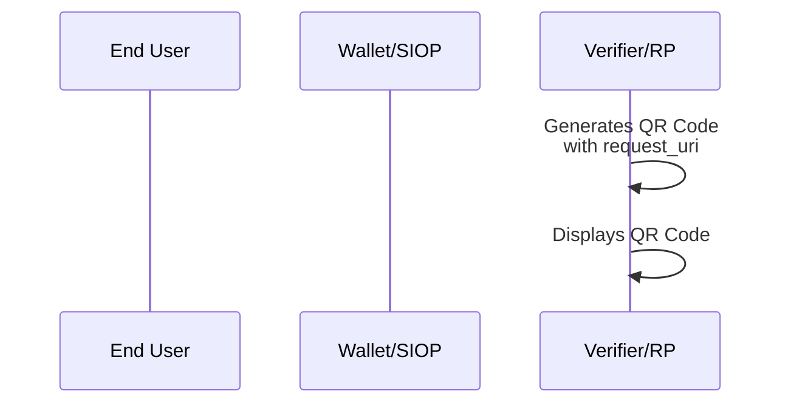
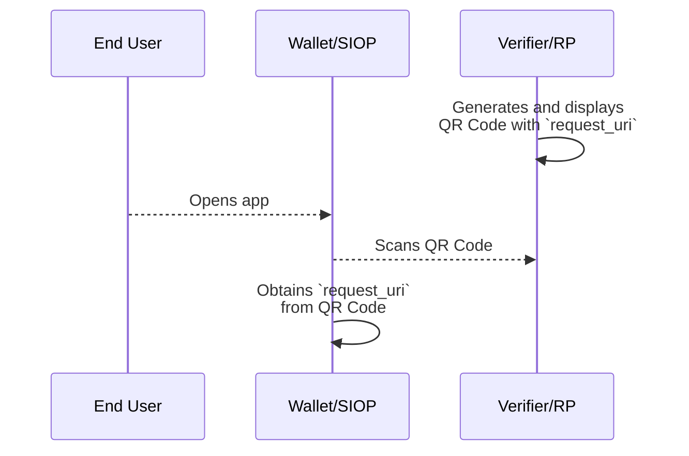

JWT VC Presentation Profile
==================

**Profile Status:** Draft

**Latest Draft:**
[https://identity.foundation/jwt-vc-interoperability-profile](https://identity.foundation/jwt-vc-interoperability-profile)

Editors:
~ [<Each editor's plain text name>]([Company](https://example.com))

Contributors:
~ [<Each contributor's plain text name>]([Company](https://example.com))

Participate:
~ [GitHub repo](https://github.com/decentralized-identity/jwt-vc-interoperability-profile)
~ [File a bug](https://github.com/decentralized-identity/jwt-vc-interoperability-profile/issues)
~ [Commit history](https://github.com/decentralized-identity/jwt-vc-interoperability-profile/commits/master)

------------------------------------

## Abstract

The JWT VC Presentation Profile defines a set of specifications to enable the interoperable presentation of Verifiable Credentials between Wallets and Verifiers/RPs.

### Audience

Who is the audience for this document.

## Status of This Document

The status of the JWT VC Presentation Profile v1.0.0 is a PRE-DRAFT specification under development within the Decentralized Identity Foundation (DIF).

### Description

The [[ref: VC Data Model]] defines the data model of Verifiable Credentials (VCs) but does not prescribe standards for transport protocol, key management, authentication, query language, etc. As a result, implementers must decide which standards to use for their presentations without a guarantee that others will support the same set of standards.

This document aims to provide a path to interoperability by standardizing the set of specifications that enable the presentation of JWT-VCs between implementers. Future versions of this document will include details on issuance and wallet interoperability. Ultimately, this profile will define a standardized approach to Verifiable Credentials so that distributed developers, apps, and systems can share credentials through common means.


### Scope

#### Scope
This document is currently scoped for the presentation of VCs between the Self-Issued OP and the Verifier/RP, also known as the RP. The Self-Issued OP is a native mobile application. The following aspects of the presentation are covered:

- Data model
- Key management
- Transportation of VCs
- Query language
- Identifiers of the entities
- Revocation of VCs

The JWT VC Presentation Profile currently supports only one response mode, assuming that a Self-Issued OP is on a different device than the one on which the End-User has initiated a user interaction at the Verifier/RP, even if it is not.

Supporting an additional response mode when Self-Issued OP is on the same device as the one on which the End-User has initiated a user interaction at the Verifier/RP might be added in the future.

#### Out of Scope
The following items are out of scope for the current version of this document:
- Issuance of VCs
- Advanced concepts in the [[ref: VC Data Model]]:
    - `credentialSchema` (`credentialType` is used instead)
    - `refreshService`
    - `termsOfUse`
    - `evidence`
    - Selective disclosure and unlinkability
    - Zero-Knowledge Proofs
    - Disputes
- Non-native Self-Issued OPs like web applications, PWAs, etc.

Note: Although selective disclosure and unlinkability are out of scope of this document, future versions will include JSON Web Proofs ([[ref:JWP]]) and JSON Web Algorithms ([[ref:JWA]]) once they get ratified in IETF.

## Structure of this Document

A description to the reader on how the document is structured.

## Terminology

Common terms in this document come from the specifications listed in (#reference).

Note: the term Verifier in the [[ref: VC Data Model]] corresponds to a term Relying Party (RP) in [[ref:SIOPv2]].

## Profile

### The Protocol Flow

This section briefly describes the end to end verification flow. Concepts and terms mentioned here will be described in more detail in subsequent sections of this document.

The flow begins as the Verifier generates a QR Code that contains a `request_uri` parameter which allows Self-Issued OP (SIOP) Request to be passed by reference. Verifier displays this QR code on their Verifier Website to initiate the exchange.




Verifier Website presents the QR Code to the End User on their Verifier Website. The End User scans the QR Code using their Wallet. The Wallet parses the QR code to obtain the `request_uri`.

The Wallet sends a GET request to the obtained `request_uri` to retrieve the Request Object. The Request Object is a signed JWT that contains a set of request parameters as defined in [[ref: SIOPv2]] and [[ref: OIDC4VP]]. In particular, Wallet will determine which VCs to submit to the Verifier by processing `presentation_definition` property in the Request Object.



Upon receiving the Request Object, the Wallet will identify VCs that satisfy the Presentation Definition and encapsulate them in a Verifiable Presentation (VP). The Wallet will complete the SIOP or Authorization Response by sending an ID Token and a VP Token to the Verifier's `redirect_uri`.

Upon receiving the ID Token and VP Token, Verifier performs necessary checks such as DID resolution, signature validation, Linked Domain validation, revocation checks, etc. and sends an acknowledgement of receipt back to the Wallet. The flow of the Wallet presenting VCs to the Verifier is now complete.


### Requirements Overview

- VCs MUST adhere to the [[ref: VC Data Model]] and be encoded as JSON and signed as JWT as defined in 6.3.1 of [[ref: VC Data Model]]. VCs encoded as JSON-LD and signed using Linked Data Proofs are NOT supported.
- For key management and authentication, Self-Issued OpenID Connect Provider v2, an extension to OpenID Connect, MUST be used as defined in [[ref: SIOPv2]].
- For transportation of VCs, OpenID Connect for Verifiable Presentations MUST be used as defined in [[ref: OIDC4VP]].
- As the query language, Presentation Exchange MUST be used and conform to the syntax defined in [[ref: OIDC4VP]], a profile of [[ref: Presentation Exchange]].
- Decentralized Identifiers (DIDs), as defined in [[ref: DID Core]], MUST be used as identifiers of the entities. Implementations MUST support did:ion as a mandatory DID method.
- To bind an owner of a DID to a controller of a certain origin, a Well Known DID Configuration MUST be used as defined in [[ref: Well Known DID]].
- For Revocation of VCs, Status List 2021 as defined in [[ref: Status List 2021]] MUST be used in combination with ID Hubs as defined in [[ref: ID Hubs]].

It is important to note that Cross-device SIOP is susceptible to a session phishing attack, where an attacker relays the request from a good Verifier/RP to a victim and is able to sign in as a victim. Implementers MUST implement mitigations most suitable to the use-case. For more details and concrete mitigations, see section 15 Security Considerations in [[ref: SIOPv2]].

### Authentication Request

[[ref: SIOPv2]] MUST be used for key management and authentication, [[ref: OIDC4VP]] MUST be used to transport Verifiable Credentials, and [[ref: Presentation Exchange]] MUST be used as a query language as defined in [[ref: OIDC4VP]].

#### Invoking Self-Issued OP

Custom URL Scheme `openid-vc://` MUST be used to invoke Self-Issued OP.

#### Self-Issued OP Request URI

Request object shall be passed by reference, rather than by value, as defined in Section 6.2 of [[ref: OIDC]]. The Holder Wallet retrieves full Request Object value from the resource at the `request_uri`.

There are multiple ways for a Verifier/RP to communicate `request_uri` to the Self-Issued OP. `request_uri` can be obtained from a QR code when Self-Issued OP is on a different device than the one on which the user interaction is occurring. It can also be obtained from a deep link when Self-Issued OP is on the same device as the one on which the user interaction is occurring.

The Self-Issued OP Request URI has an `openid` scheme.

The `request_uri` parameter is a HTTP URL from where the Holder Wallet can retrieve a full Request Object.

The Holder Wallet will retrieve the Request Object value from the `request_uri` as defined in section 6 of [[ref: OIDC]].

The Self-Issued OP request URI MUST include the following parameter:
* `request_uri`
  * REQUIRED. URL where Request Object value can be retrieved from, as specified in section 6.2 of [[ref: OIDC]].

Below is a non-normative example of a Self-Issued OP URI which will be encoded into a QR code:

```uri
openid-vc://?request_uri=https://someverifierdomain.com/v1.0/verifiablecredentials/request/a0eed079-672f-4055-a4f5-e0f5d76ecdea
```
::: todo
Need to add QR Code above
:::

#### Self-Issued OP Request Object

Upon receipt of the Request, the Holder Wallet MUST send an HTTP GET request to the `request_uri` to retrieve the referenced Request Object, unless it is already cached, and parse it to recreate the Request parameters.

The response body to that request must be an encoded JWT. The media type must be `application/jwt`

Below is a non-normative unencoded example of a retrieved Request Object:

::: example Non-Normative Request Object
```json
[[insert: ./spec/assets/3_siopv2_request.json]]
```
:::

##### Self-Issued OP Request Parameters

The Self-Issued OP request object obtained via request_uri MUST include the following parameters and values:

* `scope`
  * REQUIRED. MUST be `openid`.
* `response_type`
  * REQUIRED. MUST be `id_token`.
* `response_mode`
  * REQUIRED. MUST be `post`. Self-Issued OP Response will be sent as an HTTP POST request.
* `client_id`
  * REQUIRED. MUST be a DID of a Verifier/RP. MUST use DID method ION.
* `redirect_uri`
  * REQUIRED. URI where the response will be sent.
* `nonce`
  * REQUIRED. String value used to associate a Client session with an ID Token, and to mitigate replay attacks, as specified in section 3.1.2.1. of [[ref: OIDC]].


##### Self-Issued OP Discovery

The Verifier/RP MUST use static Self-Issued OP metadata as defined in section 6.2.1 of [[ref: SIOPv2]].

::: example SIOP Metatdata
```json
[[insert: ./spec/assets/1_siop_metadata.json]]
```
:::

##### Verifier/RP Registration Metadata {registration-metadata}

The Self-Issued OP request MUST be signed. Decentralized Identifier resolution as defined in section 10.2.2.2. of [[ref: SIOPv2]] MUST be used as the Verifier/RP Registration Metadata Resolution Method.

The RP MUST support Subject Syntax Type `did:ion` as specified in section 9.2.3. in [[ref: SIOPv2]]. RP's `client_id` MUST be expressed as using a `did:ion` URI, and the public key used to sign the request MUST be obtained from the `verificationMethod` property of a DID Document. The public key used to sign the request in question MUST be identified by the `kid` in the header of the signed request.

All RP metadata other than the public key MUST be obtained from the `registration` parameter as defined in section 6.3.1. of [[ref: SIOPv2]].

The following are Verifier/RP Registration Metadata parameters and values:
* `subject_syntax_types_supported`
  * REQUIRED. MUST include `did:ion`. Defined in [[ref: SIOPv2]].
* `vp_formats`
  * REQUIRED. MUST include `jwt_vp` and `jwt_vc`, and support signature algorithms `ES256K` and `EdDSA`. Defined in [[ref: OIDC4VP]].
* `client_name`
  * OPTIONAL. Name of the Verifier/RP to be displayed to the End-User. If present, the server SHOULD display this name to the End-User during approval. Defined in [[ref: OIDC Registration]]. If desired, representation of this Claim in different languages and scripts is represented as described in Section 2.1 of [[ref: OIDC Registration]].
* `logo_uri`
  * OPTIONAL. URL that references a logo for the Verifier/RP application. If present, the server SHOULD display this image to the End-User during approval. The value of this field MUST point to a valid image file. Defined in [[ref: OIDC Registration]]. If desired, representation of this Claim in different languages and scripts is represented as described in Section 2.1 of [[ref: OIDC Registration]].
* `client_purpose`
  * OPTIONAL. The reason why the Verifier/RP is requesting the user to present a certain credential. If present, the server SHOULD display this purpose to the End-User during approval. Defined in this document.

Below is a normative example of claims included in the `registration` parameter:

::: example
```json
{
  "subject_syntax_types_supported": [
    "did:ion"
  ],
  "vp_formats": {
    "jwt_vp": {
      "alg": [
        "ES256K",
        "EdDSA"
      ]
    },
    "jwt_vc": {
      "alg": [
        "ES256K",
        "EdDSA"
      ]
    }
  },
  "client_name": "Interop WG",
  "client_purpose": "Please share this information with us to get access to our library."
}
```
:::

Other Registration parameters defined in [[ref: OIDC Registration]] can be used.

##### Linked Domain Verification {#linked-domain}

To strengthen trust between the Verifier/RP and End-user, a Verifier/RP's DID must be bound to its website. This proves the Verifier/RP controls both the DID and the origin and allows the End-user to verify this relationship. To bind an owner of a DID to a controller of a certain origin, Well Known DID Configuration MUST be used as defined in [[ref: Well Known DID]].

When creating a Verifier/RP's DID, the domain linked to that DID MUST be included in a `serviceEndpoint` property of the DID Document as shown in a non-normative response below:

::: example
```json
{
  "service": [
    {
      "id": "#domain-1",
      "type": "LinkedDomains",
      "serviceEndpoint": "https://vcsatoshi.com"
    }
  ]
}
```
:::
Prior to a presentation request, the Verifier/RP MUST create a Domain Linkage Credential in a JSON Web Token format. It MUST be included on the website via '/.well-known/did-configuration.json'.

Below is a non-normative example of a Domain Linkage Credential that is hosted at `https://www.vcsatoshi.com/.well-known/did-configuration.json`:

::: example Domain Linkage Credential
```json
[[insert: ./spec/assets/2_domain_linkage_credential.json]]
```
:::

##### Requesting Verifiable Credentials

A Specific VC type MUST be requested using [[ref: Presentation Exchange]] syntax in the Self-Issued OP request as defined in section 8 of [[ref: OIDC4VP]]. `presentation_definition` property defined in [[ref: Presentation Exchange]] MUST be included in a `vp_token` property as defined in [[ref: OIDC4VP]], which MUST be included in a `claims` parameter defined in [[ref: OIDC]].

Below is a non-normative example of a `claims` parameter:
```json
{
  "claims": {
    "vp_token": {
      "presentation_definition": {
        "id": "c278823a-f9d7-4a22-9a73-4a1bcd87f60e",
        "input_descriptors": [
          {
            "id": "InteropExampleVC",
            "name": "InteropExampleVC",
            "purpose": "We need to verify that you have a valid InteropExampleVC Verifiable Credential.",
            "schema": [
              {
                "uri": "InteropExampleVC"
              }
            ]
          }
        ]
      }
    }
  }
}
```

## Use-Cases

Defining or referring to previously published use cases which this profile enables and supports is highly recommended.

## Examples

Embedded or referenced non-normative examples

## Implementations

- Microsoft
- Workday
- Mattr
- Ping Identity
- IBM

## Test Vectors

Embedded or referenced test vectors.

## Test Suite

Embedded or referenced test suites.

## References

### Normative References

[[def: OIDC]]
~ [Open ID Connect](https://openid.net/specs/openid-connect-core-1_0.html). Nat Sakimura, John Bradley, Michael B. Jones, Breno de Medeiros, Chuck Mortimore. 2014.11. Status: Approved Specification.

[[def: DID Core]]
~ [Decentralized Identifiers (DIDs) v1.0](https://www.w3.org/TR/2021/PR-did-core-20210803/). Manu Sporny, Dave Longley, Markus Sabadello, Drummond Reed, Orie Steele, Christopher Allen. 2021.08. Status: W3C Proposed Recommendation.

[[def: SIOPv2]]
~ [Self-Issued OpenID Provider v2](https://openid.bitbucket.io/connect/openid-connect-self-issued-v2-1_0.html). Kristina Yasuda, Michael B. Jones, Torsten Lodderstedt. 2022.04. Status: Standards Track.

[[def: OIDC4VP]]
~ [OpenID Connect for Verifiable Presentations](https://openid.net/specs/openid-connect-4-verifiable-presentations-1_0.html). Oliver Terbu, Torsten Lodderstedt, Kristina Yasuda, Adam Lemmon, Tobias Looker. 2022.04. Status: Standards Track.

[[def: VC Data Model]]
~ [Verifiable Credentials Data Model v1.1](https://www.w3.org/TR/vc-data-model/). Manu Sporny, Dave Longley, David Chadwick. 2021.08. Status: W3C Proposed Recommendation.

[[def: Presentation Exchange]]
~ [Presentation Exchange v1.0.0](https://identity.foundation/presentation-exchange/spec/v1.0.0/). Daniel Buchner, Brent Zundel, Martin Riedel.

[[def: OIDC Registration]]
~ [OpenID Connect Dynamic Client Registration 1.0 incorporating errata set 1](https://openid.net/specs/openid-connect-registration-1_0.html). Nat Sakimura, John Bradley, Michael B. Jones. 2014.11. Status: Approved Specification.

[[def: Sidetree]]
~ [Sidetree v1.0.0](https://identity.foundation/sidetree/spec/). Daniel Buchner, Orie Steele, Troy Ronda. 2021.03. Status: DIF Ratified Specification.

[[def: Well Known DID]]
~ [Well Known DID Configuration](https://identity.foundation/.well-known/resources/did-configuration/). Daniel Buchner, Orie Steele, Tobias Looker. 2021.01. Status: DIF Working Group Approved Draft.

[[def: ID Hubs]]
~ [Identity Hubs](https://identity.foundation/identity-hub/spec/)

[[def: Status List 2021]]
~ [Status List 2021](https://w3c-ccg.github.io/vc-status-list-2021/). Manu Sporny, Dave Longley, Orie Steele, Mike Prorock, Mahmoud Alkhraishi. 2022.04. Status: Draft Community Group Report.

### Non-Normative References

[[def: JWP]]
~ [JSON Web Proof](https://github.com/json-web-proofs/json-web-proofs/blob/main/draft-jmiller-json-web-proof.md). Jeremie Miller, David Waite, Michael B. Jones. Status: Internet-Draft.

[[def: JPA]]
~ [JSON Proof Algorithms](https://github.com/json-web-proofs/json-web-proofs/blob/main/draft-jmiller-json-proof-algorithms.md) Jeremie Miller, Michael B. Jones. Status: Internet-Draft.
